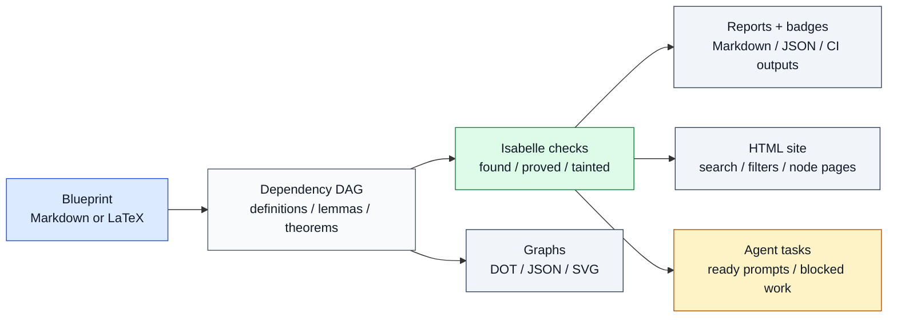

# IsabelleBlueprint

> The project layer Isabelle formalizations were missing: plan the theorem graph,
> connect it to real Isabelle facts, publish progress, and hand off proof work
> from one Markdown or LaTeX blueprint.

[](https://github.com/Arthur742Ramos/isa-blueprint/actions/workflows/blueprint.yml)
[](https://pypi.org/project/isabelle-blueprint/)
[](https://github.com/marketplace/actions/isabelleblueprint)
[](https://www.python.org)
[](#project-status)
[](LICENSE)

If you work on Isabelle/HOL, IsabelleBlueprint gives you a clean public map of
your formalization: what is planned, what depends on what, which facts already
exist, which ones are really proved, and what a human or AI agent can work on
next.

It is inspired by [Patrick Massot's Lean Blueprint](https://github.com/PatrickMassot/leanblueprint),
but built for Isabelle from the ground up: Isabelle sessions, AFP entries,
theory/fact names, `isabelle build`, PIDE dumps, `sorry` / oracle detection,
and Python-first workflows that do not require a LaTeX toolchain.



## Why Isabelle users reach for it

| Pain in a growing formalization | What IsabelleBlueprint does |
| --- | --- |
| "Which theorem is blocking this proof?" | Builds a validated dependency DAG and a `critical-path` longest-pole view that ranks the bottlenecks behind your remaining goals. |
| "Did this Isabelle name actually resolve?" | Checks facts against Isabelle sessions and AFP roots. |
| "Is this proof clean, or did `sorry` sneak in?" | Distinguishes `found`, `proved`, `tainted`, `broken`, and stale facts. |
| "How do I show progress to collaborators?" | Publishes reports, badges, graphs, and a browsable static site. |
| "What can an agent work on safely?" | Emits ready-only task packs with dependency context and prompts. |
| "Can this live in CI?" | Ships a CLI, GitHub Action outputs, JSON Schemas, and stable contracts. |

## Install

```bash
pip install isabelle-blueprint
```

That installs the `isabelle-blueprint` console script. The module form also
works everywhere:

```bash
python -m isabelle_blueprint --version
```

Optional tools unlock richer checks, but the planning/reporting workflow works
without them:

| Tool | Used for | Required? |
| --- | --- | --- |
| `isabelle` | fact/proof checks, PIDE dumps, version pins | Optional |
| Graphviz `dot` | SVG graph rendering | Optional |
| Node.js + npm | VS Code extension development | Optional |

## Start in five minutes

```bash
# 1. Scaffold a project with a blueprint, config, and GitHub Actions workflow.
isabelle-blueprint init my-formalization --template agent-ready
cd my-formalization

# 2. Add a theorem/lemma/definition stub.
isabelle-blueprint new theorem my-main-result --append

# 3. Validate the blueprint and dependency graph.
isabelle-blueprint report
isabelle-blueprint status
isabelle-blueprint roadmap
isabelle-blueprint critical-path
isabelle-blueprint graph

# 4. See exactly which proof tasks are unblocked, or hand the whole context to an agent.
isabelle-blueprint tasks
isabelle-blueprint agent-context --write

# 5. Publish a local HTML dashboard.
isabelle-blueprint web
isabelle-blueprint serve
```

Prefer LaTeX? Use the same templates with `--format latex`; `new --append`
will then add valid theorem environments to `blueprint.tex` instead of Markdown
blocks:

```bash
isabelle-blueprint init my-formalization --template agent-ready --format latex
isabelle-blueprint new theorem my-main-result --append
```

Not sure which starter fits? List the available templates and their intended
uses before scaffolding:

```bash
isabelle-blueprint init --list-templates
```

When Isabelle is available, add the real proof checks:

```bash
isabelle-blueprint compat      # version/session/AFP pin diagnostics
isabelle-blueprint check       # build wrapper session and stamp proof status
isabelle-blueprint dump        # optional PIDE-level proof-status inspection
```

## See it on real examples

From a checkout, you can explore the bundled examples without installing
Isabelle:

```bash
git clone https://github.com/Arthur742Ramos/isa-blueprint
cd isa-blueprint
pip install -e .

isabelle-blueprint report examples/group-theory
isabelle-blueprint graph  examples/group-theory
isabelle-blueprint tasks  examples/agent-workflow
```

The gallery covers tiny, intermediate, advanced, LaTeX, agent-workflow, and real
AFP-backed projects:

| Example | Format | Nodes | Coverage | Demonstrates |
| --- | --- | ---: | ---: | --- |
| [`gauss-sum`](examples/gauss-sum) | Markdown | 3 | 100% | A fully proved toy blueprint. |
| [`sqrt2-irrational`](examples/sqrt2-irrational) | Markdown | 5 | 50% | Mixed statuses and one ready task. |
| [`euclid-primes`](examples/euclid-primes) | Markdown | 6 | 40% | A compact mid-size theorem DAG. |
| [`fundamental-arithmetic`](examples/fundamental-arithmetic) | Markdown | 10 | 33% | A richer multi-level proof plan. |
| [`minimal`](examples/minimal) | Markdown | 4 | 0% | The smallest authoring template. |
| [`group-theory`](examples/group-theory) | Markdown | 10 | 28% | Status colors across three dependency levels. |
| [`latex-blueprint`](examples/latex-blueprint) | LaTeX | 8 | 0% | Lean Blueprint-style `.tex` ingestion. |
| [`agent-workflow`](examples/agent-workflow) | Markdown | 8 | 0% | Ready vs blocked proof-task orchestration. |
| [`afp-gale-stewart`](examples/afp-gale-stewart) | Markdown | 7 | 0% | A real AFP integration check (all facts found, not proved). |

See [`examples/README.md`](examples/README.md) for the full tour.

## What a blueprint looks like

A blueprint node is a small Markdown block:

````markdown
::: theorem {#sum-divides}
title: Sum divides product
isabelle: Arith_Demo.sum_divides
uses:
  - def-divides
  - lem-add-comm
status: written

If $a \mid b$ and $a \mid c$, then $a \mid (b + c)$.

## Proof

Unfold the definition of divides and use commutativity of addition.
:::
````

That one block becomes:

- a node in the dependency graph,
- an Isabelle fact target,
- a row in reports and dashboards,
- a CI/badge datapoint,
- and, when dependencies are ready, an agent task with context.

Nodes may also carry an optional `effort: N` line (a positive integer estimate of
proof difficulty). It round-trips through Markdown and LaTeX (`\effort{N}`) and
powers the effort-weighted `effort` report.

LaTeX projects can use theorem environments instead:

```latex
\begin{theorem}[Sum divides product]
\label{thm:sum-divides}
\isabelle{Arith_Demo.sum_divides}
\uses{def-divides, lem-add-comm}
\blueprintstatus{written}
\formalstatus{named}
\agentstatus{ready}

If $a \mid b$ and $a \mid c$, then $a \mid (b + c)$.
\begin{proof}
Unfold the definition of divides and use commutativity of addition.
\end{proof}
\end{theorem}
```

The LaTeX path has the same core metadata as Markdown: `\label` is the node id,
`\isabelle` maps to a fact, `\uses` records dependencies, `\tags` records
free-form labels, `\status{...}` is a single-axis shorthand, and
`\blueprintstatus` / `\formalstatus` / `\agentstatus` expose the full
three-axis status model. `\isabelletheory` and `\isabellesession` are available
when a fact name needs explicit context.

## Visual showcase

The generated graph makes progress visible immediately. Green means proved,
blue means the Isabelle fact exists, orange means a name has been recorded but
not checked yet, gray means no fact is attached, and purple marks work that is
ready for an agent or human.

**Gauss sum: 3 nodes, 100% proved**


**Square root of 2 is irrational: mixed formalization state**


**Euclid primes: compact intermediate DAG**


**Fundamental arithmetic: 10-node advanced proof plan**


## Real Isabelle / AFP integration

The [`afp-gale-stewart`](examples/afp-gale-stewart) example maps every node to
facts in the published AFP entry
[`GaleStewart_Games`](https://www.isa-afp.org/entries/GaleStewart_Games.html),
plus one local corollary layered on top. A single `check` builds a wrapper
session spanning the AFP entry and the local session.

On a machine with Isabelle2025-2 and the AFP entry built:

```bash
isabelle-blueprint compat examples/afp-gale-stewart
isabelle-blueprint check  examples/afp-gale-stewart
isabelle-blueprint report examples/afp-gale-stewart
```

The captured run stamps all seven facts `proved`:

```text
# build/Blueprint_Proof_Status.tsv (node, fact, status, oracle)
game-determined       closed_GSgame.every_game_is_determined        proved  -
position-determined   closed_GSgame.every_position_is_determined    proved  -
at-most-one-winner    GSgame.at_most_one_player_winning             proved  -
induced-play          GSgame.induced_play_def                       proved  -
play                  GSgame.play_def                               proved  -
winning-strategy      GSgame.strategy_winning_by_Even_def           proved  -
closed-determinacy    closed_GSgame.closed_game_determinacy         proved  -
```

That is the pitch in one sentence: the public blueprint says what the project is
trying to prove, and IsabelleBlueprint verifies how much of it Isabelle can
already justify.

## Outputs you can publish or automate

| Command | Output | Use it for |
| --- | --- | --- |
| `init` | `blueprint.md` or `blueprint.tex`, `isabelle-blueprint.toml`, CI workflow | Starting a clean project. |
| `new` | Markdown or LaTeX node stubs | Adding theorem/lemma/definition skeletons quickly. |
| `report` | `build/project.json`, `build/report.md`, `build/summary.json`, badges | README badges, CI summaries, dashboards. |
| `status` | Terminal or JSON health overview | Fast local triage and next-task selection. |
| `next` | Markdown, JSON, or a chosen prompt file for the next ready task | Copy-ready proof handoffs without generating the full task queue. |
| `attempt` | Prompt file under `build/attempts/`, optional check report, optional memory note (optional `--sledgehammer` appendix) | A single proof-attempt handoff/check/record loop. |
| `agent-run` | Runs an external solver against the next ready task and records the outcome | Closing the select → prompt → run → record loop in one shell-free command. |
| `roadmap` | Staged terminal/JSON plan, optional `roadmap.json` / `roadmap.md` | Parallel proof waves, blockers, and handoff plans. |
| `agent-context` | `agent-context.json`, `agent-context.md`, refreshed prompts/roadmap | One-shot AI-agent handoff bundles. |
| `graph` | `build/graph.dot`, `build/graph.json`, `build/graph.svg`, `build/graph.mmd`, `build/graph.graphml` | Dependency visualization and tooling. `--focus NODE [--depth N]` prunes to a neighbourhood; `--format graphml` exports for Gephi/Cytoscape/yEd. |
| `web` / `serve` | Static HTML site plus `site/roadmap.json` and `site/critical-path.json` | Public progress pages, roadmap boards, critical-path + owner overlays, and local preview. |
| `tasks` | `tasks.json`, `tasks.md`, per-task prompts, optional Jira/Linear CSV export | Human/AI proof-work queues. |
| `memory` | `.isabelle-blueprint/agent-memory.json` | Durable proof-attempt notes and handoffs. |
| `check` | Isabelle wrapper theory + proof-status TSV | Fact existence and clean-proof verification. |
| `dump` | PIDE-derived status | Deeper proof inspection from Isabelle dump output. |
| `compat` | Isabelle/AFP diagnostics | Reproducible session and version setup. |
| `comment` | Idempotent PR status comments | Pull-request automation. |
| `explain` / `import-theory` | Status explanations and starter blueprints from `.thy` files (`import-theory --root` imports a whole session) | Debugging and onboarding existing Isabelle projects. |
| `theory-index` | Source-only call graph, theory deps, `sorry`/`oops`, and unreferenced-entry analysis (no Isabelle needed) | Offline inspection of `.thy` trees in CI or on partial checkouts. |
| `doctor` / `schema` | Setup diagnostics and JSON Schemas | Debugging and external integrations. |
| `lint` | Text, JSON, or SARIF 2.1.0 findings (optional in-place `--fix`) | Structural/quality gates and GitHub code scanning uploads. |
| `gate` | Single pass/fail CI gate (exit 5 on failure), text or JSON | One command for lint errors + cycles + coverage + status policy in CI. |
| `prometheus` | Prometheus text-exposition metrics, stdout or `--output` file | Scraping blueprint status into Grafana/Prometheus dashboards. |
| `hooks` | A `.pre-commit-config.yaml` (stdout or `--write`) | Wiring `fmt --check` + `lint --strict` as local pre-commit hooks. |
| `notify` | Slack/Teams/Discord/generic webhook payload (dry-run or `--send`) | Posting status to a team chat channel. |
| `blame` | Per-node provenance from git history + agent memory, text or JSON | Seeing who/what last touched a node. |
| `search-facts` | Candidate Isabelle facts for unresolved fact references or a free-text query | Finding existing facts to wire into nodes without Isabelle running. |
| `effort` | Effort-weighted progress from optional per-node `effort`, text or JSON | Weighting coverage by estimated proof difficulty. |
| `staleness` | Terminal or JSON trusted-node trust audit | Finding `proved`/`found` facts that rest on broken, unproven, or newer dependencies. |
| `stats` | Terminal or JSON agent-memory analytics | Proof-attempt success rates and per-node history. |
| `burndown` | Terminal or JSON velocity / ETA forecast from `trends.json` | Projecting when full proved coverage lands, and spotting stalls or scope creep. |
| `portfolio` | Terminal or JSON cross-project roll-up | Aggregating coverage, health, and problems across every blueprint project in a monorepo or umbrella tree. |
| `isabelle-blueprint-mcp` | MCP tools, resources, and prompts | Direct consumption by AI agents and MCP clients. |
| `rename` | Rewrites ids/`uses`/labels across sources and re-keys stores | Safely renaming a node id in one step. |
| `fmt` | Canonical Markdown blueprint (in place, or `--check` CI gate) | Keeping diffs small and reviewable. |
| `version` / `completion` | Version/schema info and shell completion scripts | Scripting, diagnostics, and shell setup. |

The CLI, JSON output, and GitHub Action outputs are stable public contracts:

- [`docs/cli-contract.md`](docs/cli-contract.md)
- [`docs/json-contract.md`](docs/json-contract.md)
- [`docs/mcp.md`](docs/mcp.md)

## MCP server for AI proof agents

Install the optional MCP extra when you want AI agents to consume a blueprint
directly. A plain `pip install isabelle-blueprint` keeps the CLI and GitHub
Action lightweight and does not include the MCP runtime dependency:

```bash
pip install "isabelle-blueprint[mcp]"
isabelle-blueprint-mcp --project-dir .
```

`isabelle-blueprint-mcp` is the console script installed for MCP clients. The
server defaults to MCP stdio transport, so local clients can launch it on demand.
Point `--project-dir` at a single project or at a repository root that contains
multiple IsabelleBlueprint project subdirectories. For example:

```json
{
  "mcpServers": {
    "isabelle-blueprint": {
      "command": "isabelle-blueprint-mcp",
      "args": ["--project-dir", "/path/to/repo-or-formalization"]
    }
  }
}
```

Use `list_projects` when a repo contains more than one project, then pass the
returned project `id` (or a relative path / unique project name) as the optional
`project` argument to `status`, `next_task`, `agent_context`, and other
project-specific tools.

It exposes read-only tools such as `list_projects`, `status`, `roadmap`,
`list_tasks`, `next_task`, `agent_run_plan`, `agent_context`, `explain_node`,
`lint`, `critical_path`, `impact`, `staleness`, `stats`, `history`, `burndown`,
`portfolio`, `compat`, `suggest_facts`, `theory_index`, `graph`, `scorecard`,
`tags`, `path`, `schema`, and
`doctor`; resources such as `blueprint://projects`,
`blueprint://project`, `blueprint://projects/{project}/tasks`,
`blueprint://roadmap`, `blueprint://history`, `blueprint://burndown`,
`blueprint://portfolio`, `blueprint://fact-suggestions`,
`blueprint://theory-index`, `blueprint://staleness`, and
`blueprint://nodes/{node_id}`; and a `prove_task`
prompt for the suggested ready proof task. Add `--allow-writes` only when you
want low-risk write tools for recording proof-attempt memory and per-node
assignments. See [`docs/mcp.md`](docs/mcp.md) for the full tool/resource catalog
and `streamable-http` setup.

## Three-axis status model

Most project trackers collapse everything into "done" or "not done."
IsabelleBlueprint tracks the three states that matter in formalization:

| Axis | Values | Meaning |
| --- | --- | --- |
| **Blueprint** | `stub`, `written`, `reviewed` | Is the informal plan ready? |
| **Formal** | `missing`, `named`, `not_found`, `found`, `proved`, `tainted`, `stale`, `broken`, `failed_check` | What does Isabelle know about the target fact? |
| **Agent** | `blocked`, `ready`, `in_progress`, `attempted`, `needs_human`, `solved` | Can proof work start, continue, or needs review? |

`found` means the named Isabelle fact exists. `proved` means the fact exists and
the checker found no theorem-oracle dependency such as `Pure.skip_proof`.
`tainted` means the fact exists but depends on `sorry`, skipped proof, or another
oracle detected by Isabelle's theorem dependency API or PIDE dump output.


## Configuration

`isabelle-blueprint.toml` keeps project metadata and local Isabelle/AFP setup in
one place:

```toml
[project]
name = "My formalization"
blueprint = "blueprint.md"
# or: blueprint = "blueprint.tex"

[isabelle]
session = "My_Session"
# executable = "isabelle"
# dirs = ["."]
# version = "Isabelle2025-2"

[afp]
# root = "/path/to/afp"
# entry = "My_AFP_Entry"
# required = false

[output]
build_dir = "build"
site_dir = "site"
```

`compat` uses the Isabelle and AFP pins for diagnostics. `check` builds only the
directories passed to Isabelle, so AFP-backed projects should add the AFP
`thys` directory to `[isabelle].dirs`; the
[`afp-gale-stewart`](examples/afp-gale-stewart) example shows the pattern.

## CI, badges, and PR comments

`report` writes a Shields-compatible badge payload and a standalone SVG:

```markdown


```

Inside GitHub Actions, `report` also writes stable scalar outputs to
`$GITHUB_OUTPUT` and a compact project summary to `$GITHUB_STEP_SUMMARY`.
`comment --preview` renders the PR comment body locally; without `--preview`, it
updates the matching PR comment idempotently.

For proof-work queues, `tasks --github-sync` now writes a dry-run issue sync
plan. Add `--github-sync-confirm --repo OWNER/REPO` when you intentionally want
to create or update GitHub issues; sync uses hidden node markers plus
`.isabelle-blueprint/github-sync.json` to avoid duplicates.
Use repeatable `--github-label` and `--github-assignee` to enrich issue drafts
or sync payloads. Completed tracked nodes appear as close actions in dry-run
plans so maintainers can review issue cleanup before confirming.

## Status overview, roadmaps, agent context, memory, and explanations

Use `status` when you want a quick read on a project without writing report
artifacts:

```bash
isabelle-blueprint status .
isabelle-blueprint status . --json
isabelle-blueprint status . --top-tasks 3
isabelle-blueprint status . --top-tasks 5 --kind theorem --priority high
isabelle-blueprint next .
isabelle-blueprint next . --kind theorem --priority high
isabelle-blueprint next . --memory-state fresh
isabelle-blueprint next . --node main-theorem --json
isabelle-blueprint attempt .
isabelle-blueprint attempt . --kind lemma --difficulty medium
isabelle-blueprint attempt . --last-outcome failed
isabelle-blueprint attempt . --node main-theorem --check
isabelle-blueprint attempt . --record-outcome failed --summary "simp loops"
```

It reports coverage, problem/stale counts, cycle status, ready-task count, and
the next suggested proof task. Add `--top-tasks N` when you want a compact queue
of the first ready tasks without generating prompt files. The same repeatable
`--kind`, `--priority`, `--difficulty`, `--memory-state`, `--last-outcome`, and
`--exclude-node` filters supported by `next`/`attempt`/`tasks` also apply to
`status`; project health, metrics, and `ready_task_count` continue to describe
the full project, while `next_task` and `top_ready_tasks` narrow to the
filtered selection. Use `next` when you want the selected ready-task prompt
directly on stdout without first generating `build/prompts/`. Add repeatable
`--kind`, `--priority`, `--difficulty`, `--memory-state`, `--last-outcome`, or
`--exclude-node` filters to focus the automatic selection without changing the
canonical task queue. Use `attempt` when you want that handoff written to `build/attempts/`,
optionally followed by a `check` run and a memory note. Use `roadmap` when you
want the staged plan:

```bash
isabelle-blueprint roadmap .
isabelle-blueprint roadmap . --json
isabelle-blueprint roadmap . --write
isabelle-blueprint roadmap . --strict
isabelle-blueprint roadmap . --status ready --kind theorem
isabelle-blueprint roadmap . --since build/roadmap.json
```

It groups nodes into parallel dependency stages, labels blockers and cycles,
suggests a deterministic path through the next useful proof work, filters large
plans for handoff views, compares against a previous roadmap, and can fail CI
with `--strict` when cycles, problem nodes, stale nodes, or missing dependencies
need attention.

Use `critical-path` when you want the longest-pole view of the remaining proof
work — which incomplete theorems sit on the critical path behind each goal, and
which nodes unblock the most downstream work if you finish them next:

```bash
isabelle-blueprint critical-path .
isabelle-blueprint critical-path . --json
isabelle-blueprint critical-path . --top 10
isabelle-blueprint critical-path . --goal main-theorem
isabelle-blueprint critical-path . --fail-on-cycle   # exit 2 when cycles are present
```

It identifies each goal (a remaining node that no other remaining node depends
on), computes the critical path of incomplete dependencies behind it, ranks
bottleneck nodes by how many incomplete descendants they unblock (leverage), and
separately surfaces dependency cycles, references to unknown dependencies, and
complete nodes that still depend on incomplete ones. Where `roadmap` plans the
*stages*, `critical-path` highlights the single longest chain and the
highest-leverage nodes to attack first.

Use `impact` for the *downstream* view — the blast radius of a node, i.e. what
depends on it. Where `critical-path` walks upstream over remaining work, `impact`
walks downstream over *all* dependents (any status), so it shows how much of the
project rests on a node even when that node is already `proved`:

```bash
isabelle-blueprint impact .                      # rank every node by blast radius
isabelle-blueprint impact . --node main-lemma    # blast radius for one node
isabelle-blueprint impact . --node main-lemma --json
isabelle-blueprint impact . --top 20
```

For a single node it reports the direct dependents, the transitive blast radius
(each with its shortest dependency distance), the affected end goals that rest on
it, and the complete (`found`/`proved`) dependents that would go stale if the
node changed — a quick way to gauge the risk of touching a foundational fact.
With no `--node` it ranks every node by blast-radius size so you can spot the
highest-leverage foundations.

Use `staleness` for the project-wide *trust audit* — the inverse of `impact`.
Where `impact` asks "what rests on X?", `staleness` asks "is X's own `found`/
`proved` status well-founded?". It scans every trusted node and walks its
dependencies, flagging the ones that rest on a broken/missing dependency
(`problem`), an unproven one (`incomplete`), or a dependency that was re-checked
more recently than the node (`outdated`), plus trusted nodes caught in a cycle:

```bash
isabelle-blueprint staleness .                   # audit every trusted node
isabelle-blueprint staleness . --json
isabelle-blueprint staleness . --top 20 --max-causes 3
isabelle-blueprint staleness . --fail-on-problem   # exit 5 on broken/missing deps
```

Use `scorecard` for a single at-a-glance health number. It distills the whole
blueprint into a composite score (0–100) and a letter grade (A+…F) built from six
weighted components — coverage, integrity (problem-free), structure (acyclic + no
missing deps), freshness, documentation completeness, and agent readiness.
Components with no applicable nodes drop out and the rest are renormalised, so an
all-`proved` project scores 100/A+. Unlike the categorical `status` health label,
`scorecard` gives you a comparable number to track over time or gate on:

```bash
isabelle-blueprint scorecard .                   # score + grade + component table
isabelle-blueprint scorecard . --json
```

Use `tags` to slice progress by topic. It rolls up nodes by tag — node count,
formal targets, proved/found/problem counts, and per-tag proved-coverage — plus a
count of untagged nodes, so you can see which areas of the formalization are
lagging. Nodes carrying several tags are counted under each:

```bash
isabelle-blueprint tags .                        # per-tag coverage table
isabelle-blueprint tags . --json
```

Use `path` to explain *how* two nodes are connected. It finds the shortest
dependency path between a source and target along `uses` edges, auto-detecting
direction (`depends-on` vs `depended-on-by`) and reporting the full chain — handy
for understanding why a change ripples or whether two goals share machinery:

```bash
isabelle-blueprint path lemma-a main-theorem     # shortest dependency chain
isabelle-blueprint path lemma-a main-theorem --json
```

Use `agent-run` to close the whole loop in one command — it selects the next
ready task (honouring the same filters as `next`/`attempt`), renders the prompt,
runs an **external solver** against it, and records the outcome in agent memory.
The solver runs without a shell, with a timeout and an output-size cap, and the
`{prompt_file}` `{node_id}` `{task_id}` `{project_dir}` placeholders are
substituted per argv token (no argument injection):

```bash
# argv-native form (recommended on Windows; note --arg=-c for dash-led values)
isabelle-blueprint agent-run . --exec my-solver --arg=--prompt --arg "{prompt_file}"
# convenience string form (POSIX shlex quoting)
isabelle-blueprint agent-run . --command "my-solver --prompt {prompt_file}"
isabelle-blueprint agent-run . --dry-run --json          # preview without running
isabelle-blueprint agent-run . --node main-theorem --fail-on-failure   # exit 5 if not solved
```

Exit 0 maps to the `succeeded` outcome; a non-zero exit, timeout, or output-limit
maps to `--failure-outcome` (default `failed`); and a solver that cannot start
maps to `blocked` and is never recorded (it is a config error, not a proof
attempt). Pass `--dry-run` to preview the resolved command without running it,
`--no-record` to run without writing memory, and `--fail-on-failure` to exit 5
when the result is not `succeeded`. The MCP `agent_run_plan` tool returns the same
plan (selected task, resolved argv, and the exact `cli_argv`) without ever
executing anything.

Use `agent-context` when an AI agent needs the whole working brief in one stable
payload:

```bash
isabelle-blueprint agent-context . --json
isabelle-blueprint agent-context . --write
isabelle-blueprint agent-context . --write --max-tasks 10
isabelle-blueprint agent-context . --json --kind theorem --priority high
```

It combines the status health, roadmap suggestion, warning codes, conventional
artifact paths, recommended follow-up commands, and bounded ready-task summaries
with prompt paths. With `--write`, it also refreshes `project.json`,
`tasks.json`, `tasks.md`, `build/prompts/`, `roadmap.json`, `roadmap.md`,
`agent-context.json`, and `agent-context.md`. The same repeatable `--kind`,
`--priority`, `--difficulty`, `--memory-state`, `--last-outcome`, and
`--exclude-node` filters supported by `next`/`attempt`/`tasks`/`status` also
apply here: only the embedded `ready_tasks` list narrows to the matching
selection, while `ready_task_count`, `suggested_next_task`, `suggested_path`,
warnings, and `--write` artifacts stay canonical so the handoff remains a
faithful snapshot. Active filter flags are propagated into the recommended
`refresh_context`, `write_context`, and `next_task_prompt` command argv so
agents can replay the same focused view.
Use `memory` to preserve what a human or agent
already tried:

```bash
isabelle-blueprint memory . --node main-theorem --record \
  --outcome failed \
  --summary "simp loops after unfolding the definition" \
  --next-step "prove the monotonicity helper first"
```

The next `tasks` or `web` run includes that memory in prompts and the static task
board. Use `explain` when a node is blocked or red:

```bash
isabelle-blueprint explain . --node main-theorem
```

Existing Isabelle projects can bootstrap an initial blueprint from theory files.
Import individual files, or pass `--root DIR` to import every theory a session
`ROOT` declares — cross-theory dependencies are then inferred from the source
reference graph (no Isabelle install required):

```bash
isabelle-blueprint import-theory src/Demo.thy --output blueprint.md \
  --review-output import-review.json

# whole-session import with cross-theory dependency inference
isabelle-blueprint import-theory --root src --output blueprint.md
# pick one session when the ROOT declares several
isabelle-blueprint import-theory --root . --session Demo --output blueprint.md
```

The importer is best-effort; review generated statements, suggested
dependencies, and proof sketches before relying on the result.

### Source-only theory analysis (`theory-index`)

`theory-index` analyses `.thy` sources directly — no `isabelle` binary needed —
so it works on partial trees and in CI without a build. Point it at explicit
files, a `--root DIR` (optionally `--session NAME`), or let it discover the
nearest `ROOT`:

```bash
isabelle-blueprint theory-index --root src            # summary
isabelle-blueprint theory-index --root src --json     # full structured index
isabelle-blueprint theory-index --root src --callers base --transitive
isabelle-blueprint theory-index --root src --callees uses_base
isabelle-blueprint theory-index --root src --deps B   # imports / imported-by
isabelle-blueprint theory-index --root src --sorry    # sorry/oops markers
isabelle-blueprint theory-index --root src --unreferenced
```

`--unreferenced` lists entries no other indexed entry references; it is a
reference-graph signal, not dead-code analysis. Reference matching is
best-effort textual (honours primes and dotted qualified names; it does not
model mixfix or generated facts). The ROOT/session parser is adapted from
[`ott2/isabelle-query`](https://github.com/ott2/isabelle-query) (MIT).

## Quality gates, diffs, history, and ownership

Run `lint` for fast structural and quality checks (duplicate ids, missing
dependencies, cycles, broken or stale formal status, empty statements, missing
informal proofs, formal-intent nodes without an Isabelle reference, and isolated
nodes):

```bash
isabelle-blueprint lint .
isabelle-blueprint lint . --json
isabelle-blueprint lint . --format sarif   # SARIF 2.1.0 for GitHub code scanning
isabelle-blueprint lint . --strict        # exit 2 on any error-severity finding
```

Gate CI on proof health from any reporting command with the shared
`--fail-on STATUS` flag (repeat it to select several statuses; the `problem`
alias expands to every problem status), and re-run `check`, `report`, `status`,
or `tasks` automatically while you edit with `--watch`:

```bash
isabelle-blueprint check . --fail-on problem
isabelle-blueprint report . --fail-on not_found --fail-on broken
isabelle-blueprint status . --fail-on problem
isabelle-blueprint check . --watch --interval 2
isabelle-blueprint report . --watch        # also on status and tasks
```

Compare the current project against a saved `build/project.json` baseline to see
what changed and catch regressions (a proof coming undone, a healthy status
turning into a problem, a removed node, or a slide down the confidence ladder
such as `found` to `named`/`missing`):

```bash
isabelle-blueprint diff build/project.json .
isabelle-blueprint diff build/project.json . --json
isabelle-blueprint diff build/project.json . --fail-on-regression   # exit 5
```

Track coverage over time from the recorded `trends.json`, render the dependency
graph as Mermaid, record per-node ownership, and rename a node across every
source and store in one step:

```bash
isabelle-blueprint history .
isabelle-blueprint history . --json --limit 10
isabelle-blueprint burndown .                      # ETA to full proved coverage
isabelle-blueprint burndown . --json --fail-when-stalled
isabelle-blueprint portfolio .                     # roll up every project in the tree
isabelle-blueprint portfolio . --json --fail-on-problem
isabelle-blueprint graph . --format mermaid        # writes build/graph.mmd
isabelle-blueprint graph . --format graphml        # writes build/graph.graphml (Gephi/yEd)
isabelle-blueprint graph . --focus main-theorem --depth 2   # neighbourhood subgraph
isabelle-blueprint scorecard .                     # 0-100 quality score + letter grade
isabelle-blueprint scorecard . --json
isabelle-blueprint tags .                          # per-tag coverage rollup
isabelle-blueprint path lemma-a main-theorem       # shortest dependency path
isabelle-blueprint assign main-theorem --owner alice
isabelle-blueprint assign                          # list current owners
isabelle-blueprint assign main-theorem --clear
isabelle-blueprint rename old-id new-id --dry-run
isabelle-blueprint rename old-id new-id
```

`history` reads only `trends.json`, so it keeps working even when the current
blueprint fails to parse. `burndown` reads the same store and forecasts an ETA to
full proved coverage from the slope of *remaining* work, so it reflects scope
growth — proving faster does not move the date if the target grows just as fast —
and flags `stalled`, `regressing`, or `scope_growing` projects. `portfolio` scans a
directory tree for every blueprint project and rolls up coverage, health, and
problem/cycle flags into one dashboard (loading is best-effort, so an unparseable
project becomes an error entry instead of aborting the roll-up). `rename` runs a
re-parse safety check before writing and rolls back source edits if a write fails
part way through.

## VS Code extension

The companion extension under [`vscode/`](vscode/) reads `build/project.json`
and adds:

- a proof-cockpit **Blueprint Nodes** explorer grouped by ready, problem, stale,
  blocked, and complete work,
- inline diagnostics for missing/stale/broken/tainted nodes,
- source navigation,
- refresh/watch support,
- dependency navigation, status quick fixes, and node explanations,
- commands to run `report`, `check`, `tasks`, `roadmap`, and `agent-context`,
- next-task prompt preview directly from the CLI,
- task prompt preview from generated `build/prompts/`,
- memory recording from the editor context menu.

## Project status

IsabelleBlueprint is in the stable v1 line. The CLI surface, JSON file shapes,
and GitHub Action outputs are frozen for minor releases; breaking changes belong
in a future 2.0.

The current v1.15.0 release includes the Markdown and LaTeX parsers, Isabelle
checker, PIDE dump support, AFP compatibility checks, Graphviz and Mermaid
output, static site, live preview, task packs, project templates, fact
suggestions, JSON Schemas, plugin API, PR comments, GitHub Release automation,
VS Code extension support, agent memory, dependency-aware status explanations,
theory import bootstrap, and bidirectional GitHub issue synchronization, plus a
canonical `fmt` formatter, fast `status` and staged `roadmap` planning commands,
memory-aware and exclusion-filtered direct `next` / `attempt` handoffs, one-shot
`agent-context` bundles, and a workflow toolkit of `lint` (text/JSON/SARIF),
`diff`, `history`, `assign`, `rename`, `stats`, `version`, and `completion`
commands with shared `--fail-on` policy, `--watch` modes, `--color` output, and
the optional MCP server entry point.

Community docs:

- [Contributing](CONTRIBUTING.md)
- [Security policy](SECURITY.md)
- [Code of conduct](CODE_OF_CONDUCT.md)
- [Issues](https://github.com/Arthur742Ramos/isa-blueprint/issues)

## Development

```bash
pip install -e ".[dev]"
pytest -q
```

VS Code extension development:

```bash
cd vscode
npm install
npm run compile
```

The Python test suite runs on Ubuntu and Windows in CI across Python
3.11-3.13. The extension compiles with TypeScript in the `vscode/` package.

## License

MIT - see [LICENSE](LICENSE).

Inspired by [Lean Blueprint](https://github.com/PatrickMassot/leanblueprint) by
Patrick Massot.
