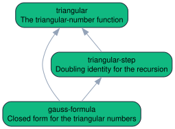
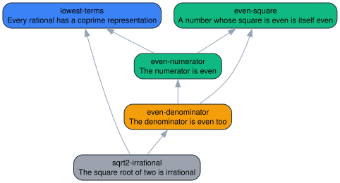
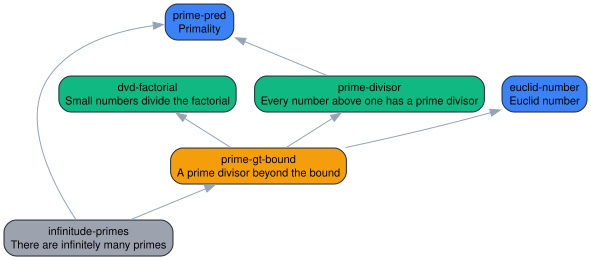
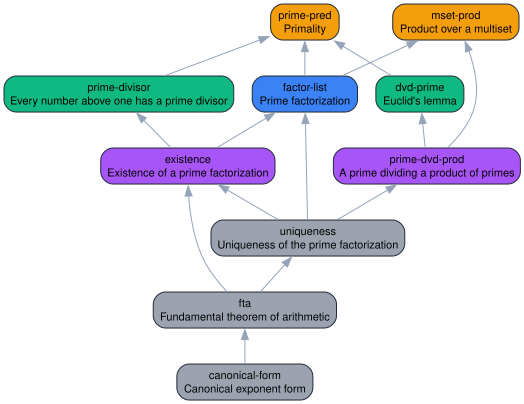

# IsabelleBlueprint

> The project layer Isabelle formalizations were missing: plan the theorem graph,
> connect it to real Isabelle facts, publish progress, and hand off proof work
> from one Markdown or LaTeX blueprint.

[](https://github.com/Arthur742Ramos/isa-blueprint/actions/workflows/blueprint.yml)
[](https://pypi.org/project/isabelle-blueprint/)
[](https://github.com/marketplace/actions/isabelleblueprint)
[](https://www.python.org)
[](#project-status)
[](LICENSE)

If you work on Isabelle/HOL, IsabelleBlueprint gives you a clean public map of
your formalization: what is planned, what depends on what, which facts already
exist, which ones are really proved, and what a human or AI agent can work on
next.

It is inspired by [Patrick Massot's Lean Blueprint](https://github.com/PatrickMassot/leanblueprint),
but built for Isabelle from the ground up: Isabelle sessions, AFP entries,
theory/fact names, `isabelle build`, PIDE dumps, `sorry` / oracle detection,
and Python-first workflows that do not require a LaTeX toolchain.

```mermaid
flowchart LR
    B["Blueprint<br/>Markdown or LaTeX"] --> D["Dependency DAG<br/>definitions / lemmas / theorems"]
    D --> C["Isabelle checks<br/>found / proved / tainted"]
    D --> G["Graphs<br/>DOT / JSON / SVG"]
    C --> R["Reports + badges<br/>Markdown / JSON / CI outputs"]
    C --> W["HTML site<br/>search / filters / node pages"]
    C --> T["Agent tasks<br/>ready prompts / blocked work"]
    classDef blueprint fill:#dbeafe,stroke:#1d4ed8,color:#111827;
    classDef dependency fill:#f8fafc,stroke:#475569,color:#111827;
    classDef checks fill:#dcfce7,stroke:#15803d,color:#111827;
    classDef output fill:#f1f5f9,stroke:#334155,color:#111827;
    classDef tasks fill:#fef3c7,stroke:#b45309,color:#111827;
    class B blueprint;
    class D dependency;
    class C checks;
    class G,R,W output;
    class T tasks;
    linkStyle default stroke:#64748b;
```

## Why Isabelle users reach for it

| Pain in a growing formalization | What IsabelleBlueprint does |
| --- | --- |
| "Which theorem is blocking this proof?" | Builds a validated dependency DAG from your blueprint. |
| "Did this Isabelle name actually resolve?" | Checks facts against Isabelle sessions and AFP roots. |
| "Is this proof clean, or did `sorry` sneak in?" | Distinguishes `found`, `proved`, `tainted`, `broken`, and stale facts. |
| "How do I show progress to collaborators?" | Publishes reports, badges, graphs, and a browsable static site. |
| "What can an agent work on safely?" | Emits ready-only task packs with dependency context and prompts. |
| "Can this live in CI?" | Ships a CLI, GitHub Action outputs, JSON Schemas, and stable contracts. |

## Install

```bash
pip install isabelle-blueprint
```

That installs the `isabelle-blueprint` console script. The module form also
works everywhere:

```bash
python -m isabelle_blueprint --version
```

Optional tools unlock richer checks, but the planning/reporting workflow works
without them:

| Tool | Used for | Required? |
| --- | --- | --- |
| `isabelle` | fact/proof checks, PIDE dumps, version pins | Optional |
| Graphviz `dot` | SVG graph rendering | Optional |
| Node.js + npm | VS Code extension development | Optional |

## Start in five minutes

```bash
# 1. Scaffold a project with a blueprint, config, and GitHub Actions workflow.
isabelle-blueprint init my-formalization --template agent-ready
cd my-formalization

# 2. Add a theorem/lemma/definition stub.
isabelle-blueprint new theorem my-main-result --append

# 3. Validate the blueprint and dependency graph.
isabelle-blueprint report
isabelle-blueprint graph

# 4. See exactly which proof tasks are unblocked.
isabelle-blueprint tasks

# 5. Publish a local HTML dashboard.
isabelle-blueprint web
isabelle-blueprint serve
```

When Isabelle is available, add the real proof checks:

```bash
isabelle-blueprint compat      # version/session/AFP pin diagnostics
isabelle-blueprint check       # build wrapper session and stamp proof status
isabelle-blueprint dump        # optional PIDE-level proof-status inspection
```

## See it on real examples

From a checkout, you can explore the bundled examples without installing
Isabelle:

```bash
git clone https://github.com/Arthur742Ramos/isa-blueprint
cd isa-blueprint
pip install -e .

isabelle-blueprint report examples/group-theory
isabelle-blueprint graph  examples/group-theory
isabelle-blueprint tasks  examples/agent-workflow
```

The gallery covers tiny, intermediate, advanced, LaTeX, agent-workflow, and real
AFP-backed projects:

| Example | Format | Nodes | Coverage | Demonstrates |
| --- | --- | ---: | ---: | --- |
| [`gauss-sum`](examples/gauss-sum) | Markdown | 3 | 100% | A fully proved toy blueprint. |
| [`sqrt2-irrational`](examples/sqrt2-irrational) | Markdown | 5 | 60% | Mixed statuses and one ready task. |
| [`euclid-primes`](examples/euclid-primes) | Markdown | 6 | 66.7% | A compact mid-size theorem DAG. |
| [`fundamental-arithmetic`](examples/fundamental-arithmetic) | Markdown | 10 | 50% | A richer multi-level proof plan. |
| [`minimal`](examples/minimal) | Markdown | 4 | 0% | The smallest authoring template. |
| [`group-theory`](examples/group-theory) | Markdown | 10 | 50% | Status colors across three dependency levels. |
| [`latex-blueprint`](examples/latex-blueprint) | LaTeX | 8 | 50% | Lean Blueprint-style `.tex` ingestion. |
| [`agent-workflow`](examples/agent-workflow) | Markdown | 8 | 38% | Ready vs blocked proof-task orchestration. |
| [`afp-gale-stewart`](examples/afp-gale-stewart) | Markdown | 7 | 100% | A real AFP integration check. |

See [`examples/README.md`](examples/README.md) for the full tour.

## What a blueprint looks like

A blueprint node is a small Markdown block:

````markdown
::: theorem {#sum-divides}
title: Sum divides product
isabelle: Arith_Demo.sum_divides
uses:
  - def-divides
  - lem-add-comm
status: written

If $a \mid b$ and $a \mid c$, then $a \mid (b + c)$.

## Proof

Unfold the definition of divides and use commutativity of addition.
:::
````

That one block becomes:

- a node in the dependency graph,
- an Isabelle fact target,
- a row in reports and dashboards,
- a CI/badge datapoint,
- and, when dependencies are ready, an agent task with context.

LaTeX projects can use theorem environments instead:

```latex
\begin{theorem}[Sum divides product]
\label{thm:sum-divides}
\isabelle{Arith_Demo.sum_divides}
\uses{def-divides, lem-add-comm}

If $a \mid b$ and $a \mid c$, then $a \mid (b + c)$.
\end{theorem}
```

## Visual showcase

The generated graph makes progress visible immediately. Green means proved,
blue means the Isabelle fact exists, orange means a name has been recorded but
not checked yet, gray means no fact is attached, and purple marks work that is
ready for an agent or human.

**Gauss sum: 3 nodes, 100% proved**



**Square root of 2 is irrational: mixed formalization state**



**Euclid primes: compact intermediate DAG**



**Fundamental arithmetic: 10-node advanced proof plan**



## Real Isabelle / AFP integration

The [`afp-gale-stewart`](examples/afp-gale-stewart) example maps every node to
facts in the published AFP entry
[`GaleStewart_Games`](https://www.isa-afp.org/entries/GaleStewart_Games.html),
plus one local corollary layered on top. A single `check` builds a wrapper
session spanning the AFP entry and the local session.

On a machine with Isabelle2025-2 and the AFP entry built:

```bash
isabelle-blueprint compat examples/afp-gale-stewart
isabelle-blueprint check  examples/afp-gale-stewart
isabelle-blueprint report examples/afp-gale-stewart
```

The captured run stamps all seven facts `proved`:

```text
# build/Blueprint_Proof_Status.tsv (node, fact, status, oracle)
game-determined       closed_GSgame.every_game_is_determined        proved  -
position-determined   closed_GSgame.every_position_is_determined    proved  -
at-most-one-winner    GSgame.at_most_one_player_winning             proved  -
induced-play          GSgame.induced_play_def                       proved  -
play                  GSgame.play_def                               proved  -
winning-strategy      GSgame.strategy_winning_by_Even_def           proved  -
closed-determinacy    closed_GSgame.closed_game_determinacy         proved  -
```

That is the pitch in one sentence: the public blueprint says what the project is
trying to prove, and IsabelleBlueprint verifies how much of it Isabelle can
already justify.

## Outputs you can publish or automate

| Command | Output | Use it for |
| --- | --- | --- |
| `init` | `blueprint.md`, `isabelle-blueprint.toml`, CI workflow | Starting a clean project. |
| `new` | Node stubs | Adding theorem/lemma/definition skeletons quickly. |
| `report` | `build/project.json`, `build/report.md`, `build/summary.json`, badges | README badges, CI summaries, dashboards. |
| `graph` | `build/graph.dot`, `build/graph.json`, `build/graph.svg` | Dependency visualization and tooling. |
| `web` / `serve` | Static HTML site | Public progress pages and local preview. |
| `tasks` | `tasks.json`, `tasks.md`, per-task prompts | Human/AI proof-work queues. |
| `check` | Isabelle wrapper theory + proof-status TSV | Fact existence and clean-proof verification. |
| `dump` | PIDE-derived status | Deeper proof inspection from Isabelle dump output. |
| `compat` | Isabelle/AFP diagnostics | Reproducible session and version setup. |
| `comment` | Idempotent PR status comments | Pull-request automation. |
| `doctor` / `schema` | Setup diagnostics and JSON Schemas | Debugging and external integrations. |

The CLI, JSON output, and GitHub Action outputs are stable public contracts:

- [`docs/cli-contract.md`](docs/cli-contract.md)
- [`docs/json-contract.md`](docs/json-contract.md)

## Three-axis status model

Most project trackers collapse everything into "done" or "not done."
IsabelleBlueprint tracks the three states that matter in formalization:

| Axis | Values | Meaning |
| --- | --- | --- |
| **Blueprint** | `stub`, `written`, `reviewed` | Is the informal plan ready? |
| **Formal** | `missing`, `named`, `not_found`, `found`, `proved`, `tainted`, `stale`, `broken`, `failed_check` | What does Isabelle know about the target fact? |
| **Agent** | `blocked`, `ready`, `in_progress`, `attempted`, `needs_human`, `solved` | Can proof work start, continue, or needs review? |

`found` means the named Isabelle fact exists. `proved` means the fact exists and
the checker found no theorem-oracle dependency such as `Pure.skip_proof`.
`tainted` means the fact exists but depends on `sorry`, skipped proof, or another
oracle detected by Isabelle's theorem dependency API or PIDE dump output.


## Configuration

`isabelle-blueprint.toml` keeps project metadata and local Isabelle/AFP setup in
one place:

```toml
[project]
name = "My formalization"
blueprint = "blueprint.md"

[isabelle]
session = "My_Session"
# executable = "isabelle"
# dirs = ["."]
# version = "Isabelle2025-2"

[afp]
# root = "/path/to/afp"
# entry = "My_AFP_Entry"
# required = false

[output]
build_dir = "build"
site_dir = "site"
```

`compat` uses the Isabelle and AFP pins for diagnostics. `check` builds only the
directories passed to Isabelle, so AFP-backed projects should add the AFP
`thys` directory to `[isabelle].dirs`; the
[`afp-gale-stewart`](examples/afp-gale-stewart) example shows the pattern.

## CI, badges, and PR comments

`report` writes a Shields-compatible badge payload and a standalone SVG:

```markdown


```

Inside GitHub Actions, `report` also writes stable scalar outputs to
`$GITHUB_OUTPUT` and a compact project summary to `$GITHUB_STEP_SUMMARY`.
`comment --preview` renders the PR comment body locally; without `--preview`, it
updates the matching PR comment idempotently.

## VS Code extension

The companion extension under [`vscode/`](vscode/) reads `build/project.json`
and adds:

- a **Blueprint Nodes** explorer,
- inline diagnostics for missing/stale/broken/tainted nodes,
- source navigation,
- refresh/watch support,
- dependency navigation and quick fixes.

## Project status

IsabelleBlueprint is in the stable v1 line. The CLI surface, JSON file shapes,
and GitHub Action outputs are frozen for minor releases; breaking changes belong
in a future 2.0.

The current v1.1 release includes the Markdown and LaTeX parsers, Isabelle
checker, PIDE dump support, AFP compatibility checks, Graphviz output, static
site, live preview, task packs, project templates, fact suggestions, JSON
Schemas, plugin API, PR comments, GitHub Release automation, and VS Code
extension support.

Community docs:

- [Contributing](CONTRIBUTING.md)
- [Security policy](SECURITY.md)
- [Code of conduct](CODE_OF_CONDUCT.md)
- [Issues](https://github.com/Arthur742Ramos/isa-blueprint/issues)

## Development

```bash
pip install -e ".[dev]"
pytest -q
```

VS Code extension development:

```bash
cd vscode
npm install
npm run compile
```

The Python test suite runs on Ubuntu and Windows in CI across Python
3.11-3.13. The extension compiles with TypeScript in the `vscode/` package.

## License

MIT - see [LICENSE](LICENSE).

Inspired by [Lean Blueprint](https://github.com/PatrickMassot/leanblueprint) by
Patrick Massot.
