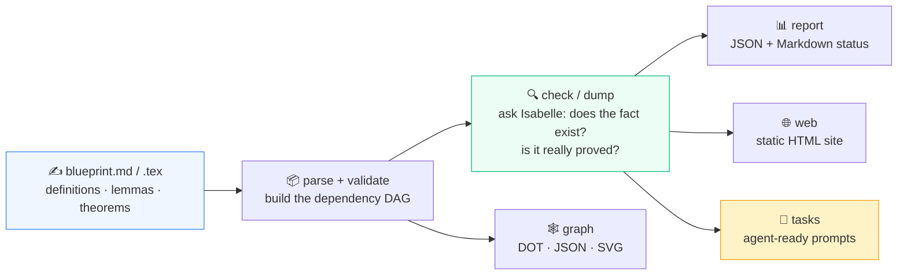
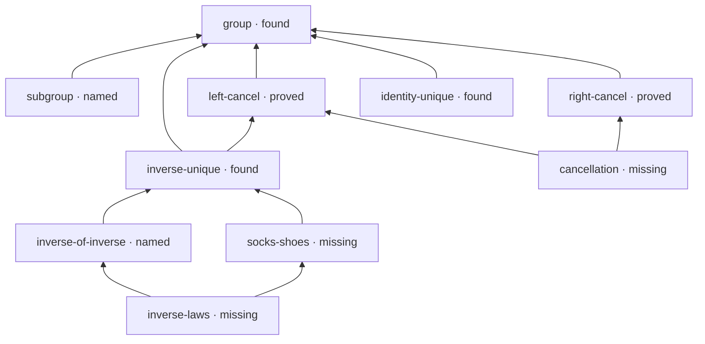
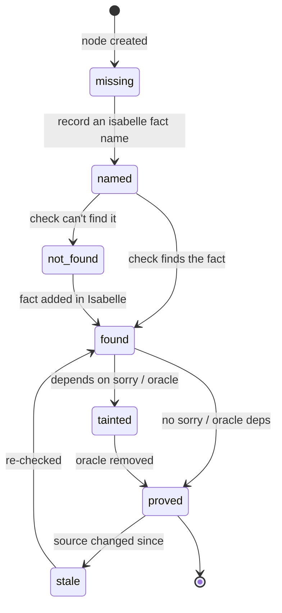

# IsabelleBlueprint

> Project planning, dependency tracking, documentation, and AI-task orchestration for **Isabelle/HOL** formalization projects.

[](https://github.com/Arthur742Ramos/isa-blueprint/actions/workflows/blueprint.yml)
[](https://pypi.org/project/isabelle-blueprint/)
[](https://github.com/marketplace/actions/isabelleblueprint)
[](https://www.python.org)
[](#roadmap)
[](LICENSE)

IsabelleBlueprint lets you write a Markdown (or LaTeX) "blueprint" of the theorems, definitions, and lemmas you intend to formalize, link them to concrete Isabelle facts, validate the dependency graph, render a browsable HTML status site, and emit ready-to-execute prompts for AI agents working on the proofs.

It is heavily inspired by [Patrick Massot's *Lean Blueprint*](https://github.com/PatrickMassot/leanblueprint), but it is **Isabelle-aware from the ground up** and **Python-first** (no LaTeX toolchain required).



From one source of truth you get a validated plan, a live status picture, a
browsable site, and a queue of proof obligations — each tagged with whether a
human or an AI agent can start on it right now.

---

## Status — v1.1

This is the stable v1 line. Everything in the original roadmap, plus the
v0.6–v1.1 follow-ups, is shipped. The CLI surface, JSON file shapes, and GitHub
Action outputs are frozen public contracts documented under [`docs/`](docs/) —
breaking changes will only ship in a 2.0 line.

Project community docs: [Contributing](CONTRIBUTING.md),
[Security policy](SECURITY.md), and [Code of conduct](CODE_OF_CONDUCT.md).

What works today:

- ✅ Markdown blueprint parser (single-`:::` blocks, optional YAML metadata, humanised titles)
- ✅ `new` stub generator + author-friendly snippets/completion in the VS Code extension
- ✅ LaTeX blueprint parser for Lean Blueprint-style `\label`, `\lean`, `\uses`, and proof environments
- ✅ Three-axis status model: blueprint × formal × agent
- ✅ Dependency validation (cycles, missing references, duplicates)
- ✅ Graphviz output (`graph.dot`, `graph.json`, optional `graph.svg`)
- ✅ Isabelle checker (`Blueprint_Check.thy` generator + `isabelle build` wrapper) with `proved` vs `tainted` status from theorem oracle/dependency inspection
- ✅ PIDE dump inspection via `isabelle-blueprint dump`
- ✅ Isabelle/AFP compatibility and version-pin reports via `isabelle-blueprint compat`
- ✅ Static HTML site (index, per-node pages, dependency graph, status, tasks)
- ✅ Agent task pack (`tasks.json`, `tasks.md`, per-task Markdown prompts)
- ✅ JSON / Markdown status reports
- ✅ VS Code extension under [`vscode/`](vscode/) for explorer status and inline diagnostics
- ✅ `init` scaffolder with project templates and GitHub Actions workflow
- ✅ Minimal end-to-end example under [`examples/minimal/`](examples/minimal)
- ✅ Real AFP integration example under [`examples/afp-gale-stewart/`](examples/afp-gale-stewart) — cross-session `check` proving Gale–Stewart determinacy against the published `GaleStewart_Games` entry
- ✅ pytest suite + cross-platform CI (Ubuntu + Windows, Python 3.11/3.12/3.13)
- ✅ **v0.6** — `check --incremental` (per-fact cache in `build/check-cache.json`) and `check --jobs N` (parallel session builds)
- ✅ **v0.7** — Multi-blueprint projects via `[project].blueprints` with duplicate-id detection across sources
- ✅ **v0.8** — Click-through formal-status filter on the dependency graph (`graph.html`) and bounded coverage/problem trend chart from `build/trends.json`
- ✅ **v0.9** — Plugin API (`isabelle_blueprint.status_providers` entry-point group), plus `isabelle-blueprint comment` for idempotent PR status comments (urllib-only, no extra deps)
- ✅ **v1.1** — Release dry-runs, GitHub Release automation, `doctor`,
  live web preview, JSON Schemas, smarter task metadata, fact suggestions,
  site search, richer dashboard deltas, project templates, and VS Code
  dependency quick fixes/navigation

---

## Install

```bash
pip install isabelle-blueprint
```

or from a checkout:

```bash
git clone https://github.com/Arthur742Ramos/isa-blueprint
cd isa-blueprint
pip install -e ".[dev]"
```

Both forms install an `isabelle-blueprint` console script. If your Python
scripts directory is not on `PATH`, every command also works through the
module form:

```bash
python -m isabelle_blueprint --version
python -m isabelle_blueprint report examples/group-theory
```

Optional system dependencies:

| Tool       | Used for                                       | Required? |
|------------|------------------------------------------------|-----------|
| `isabelle` | fact/proof checks, PIDE dumps, version pins   | optional — without it, `check` still validates the blueprint structure |
| `dot` (Graphviz) | SVG rendering of the dependency graph    | optional — `graph.dot` / `graph.json` are always emitted |
| Node.js + npm | building the VS Code extension             | optional — only needed for extension development |

---

## Quickstart

```bash
# 1. Scaffold a new project (creates blueprint.md + isabelle-blueprint.toml + CI workflow)
isabelle-blueprint init my-project
cd my-project

# 2. Edit blueprint.md, adding your definitions, lemmas, and theorems.
#    See examples/minimal/blueprint.md for the syntax — or scaffold a node:
isabelle-blueprint new theorem my-headline-result --append

# 3. Validate structure and (optionally) check Isabelle fact/proof status.
#    (Requires Isabelle; see the note below before running on a live install.)
isabelle-blueprint check

# 4. Check local Isabelle/AFP compatibility pins.
isabelle-blueprint compat

# 5. Emit the dependency graph (DOT + JSON; SVG if Graphviz is installed).
isabelle-blueprint graph

# 6. Render the static HTML site to ./site
isabelle-blueprint web

#    Or live-preview it while editing
isabelle-blueprint serve

# 7. Generate ready-to-execute agent tasks and per-task prompts.
isabelle-blueprint tasks

#    Include GitHub issue drafts for those tasks without touching GitHub
isabelle-blueprint tasks --github-issues

# 8. Produce JSON and Markdown status reports.
isabelle-blueprint report

# 9. Post (or update) a GitHub PR status comment.
#    Use --preview to write build/pr-comment.md locally without touching GitHub.
isabelle-blueprint comment --preview

# 10. Diagnose local tooling and export JSON Schemas.
isabelle-blueprint doctor
isabelle-blueprint schema --out schemas
```

Try it on the bundled examples (no Isabelle required for `report` / `graph` / `tasks`):

```bash
isabelle-blueprint report examples/group-theory
isabelle-blueprint graph  examples/group-theory
isabelle-blueprint tasks  examples/agent-workflow
```

> **Tip:** `report`, `graph`, `tasks`, and `compat` run without Isabelle, so
> they are the fastest way to explore the tool. `check` and `dump` invoke
> Isabelle itself; run those once you have a working Isabelle/AFP install
> configured in `isabelle-blueprint.toml`.

---

## Visual tour

A blueprint is a dependency graph. Here is the bundled
[`group-theory`](examples/group-theory) example — ten nodes across three
levels, fanning out from the `group` definition up to two top-level theorems:



`isabelle-blueprint report` turns that into a status table:

```text
# Group theory demo - blueprint status

- Nodes: **10**
- Formalised (found or proved): **5** (50.0%)

| Formal status | Count |
| --- | ---: |
| `found` | 3 |
| `missing` | 3 |
| `named` | 2 |
| `proved` | 2 |
```

…and `isabelle-blueprint tasks` reports exactly which obligations are
unblocked — every dependency formalised, so an agent can start now:

```text
# Agent tasks

- **Subgroup** (`subgroup`) -> `Group_Demo.subgroup_def`
- **Inverse of the inverse** (`inverse-of-inverse`) -> `Group_Demo.inverse_of_inverse`
- **Socks-and-shoes law** (`socks-shoes`) -> `Group_Demo.socks_shoes`
- **Cancellation theorem** (`cancellation`) -> `Group_Demo.cancellation`

Total: 4 ready task(s).
```

### Status colour legend

The `web` and `report` outputs colour-code the **formal** axis so reviewers
can see at a glance where work is needed:

| Colour | Status | Meaning |
| --- | --- | --- |
| 🔵 `#3b82f6` | `found` | The named Isabelle fact exists. |
| 🟢 `#10b981` | `proved` | Exists with no `sorry`/oracle dependency. |
| 🟠 `#f59e0b` | `named` | A name is recorded; existence not yet confirmed. |
| 🟣 `#a855f7` | `tainted` | Exists but depends on `sorry`/skip/oracle. |
| 🔴 `#ef4444` | `not_found` | The name was searched for and is absent. |
| 🟡 `#fbbf24` | `stale` | Previously verified; source has since changed. |
| 🟥 `#dc2626` | `broken` | The Isabelle build failed for this node. |
| 🟥 `#dc2626` | `failed_check` | Generic check failure (kept for forward compatibility). |
| ⚫ `#9ca3af` | `missing` | No Isabelle fact recorded yet. |

---

## Examples

The [`examples/`](examples/) directory is a gallery of runnable projects —
explore them with `report` / `graph` / `tasks` without a working Isabelle:

| Example | Format | Nodes | Coverage | Demonstrates |
| --- | --- | ---: | ---: | --- |
| [`gauss-sum`](examples/gauss-sum) | Markdown (`:::`) | 3 | 100% | **Trivial / all-green.** `1+…+n = n(n+1)/2` by induction; every node `proved`. |
| [`sqrt2-irrational`](examples/sqrt2-irrational) | Markdown | 5 | 60% | **Intermediate.** `√2` irrational; mixed statuses, one ready task. |
| [`euclid-primes`](examples/euclid-primes) | Markdown | 6 | 66.7% | **Intermediate.** Euclid's infinitude of primes; partially-formalised DAG. |
| [`fundamental-arithmetic`](examples/fundamental-arithmetic) | Markdown | 10 | 50% | **Advanced.** Prime factorisation existence + uniqueness; two agent-ready tasks. |
| [`minimal`](examples/minimal) | Markdown | 4 | 0% | Smallest blueprint; every subcommand. |
| [`group-theory`](examples/group-theory) | Markdown | 10 | 50% | Multi-level DAG mixing `missing` / `named` / `found` / `proved`. |
| [`latex-blueprint`](examples/latex-blueprint) | LaTeX | 8 | 50% | `.tex` ingestion with `\isabelle` / `\uses` / `\isabelleok`. |
| [`agent-workflow`](examples/agent-workflow) | Markdown | 8 | 38% | Task orchestration (ready vs blocked) + `compat` pinning. |
| [`afp-gale-stewart`](examples/afp-gale-stewart) | Markdown | 7 | 100% | **Real AFP entry**: cross-session `check`, all 7 facts `proved` (see below). |

See [`examples/README.md`](examples/README.md) for the full tour.

### Showcase gallery

Four worked proofs spanning a complexity gradient — each graph below is the
actual `isabelle-blueprint web` / `graph` output, colour-coded by formal status
(see the [legend](#status-colour-legend) above) — with agent-ready open tasks
drawn in purple regardless of their formal status. They render natively on GitHub.

**① gauss-sum — trivial, 3 nodes, 100% proved (all green)**

The closed form `1 + 2 + … + n = n(n+1)/2` by a single induction, written in the
lighter `::: kind {#id}` grammar. Every node is `proved`, so this is what a
*finished* blueprint looks like.


**② sqrt2-irrational — intermediate, 5 nodes, 60% (mixed colours)**

The classic reductio that `√2` is irrational. Parity and coprimality helper
lemmas mix `proved` / `found` / `named` / `missing`, so the graph shows the full
colour palette and `tasks` surfaces one ready obligation.


**③ euclid-primes — intermediate, 6 nodes, 66.7%**

Euclid's infinitude of the primes. A compact DAG with two open obligations near
the top and one agent-ready task.


**④ fundamental-arithmetic — advanced, 10 nodes, 50%, two ready tasks**

Existence *and* uniqueness of prime factorisation: a multi-level, ten-node DAG
with proved helper lemmas feeding several still-open theorems — the richest
graph in the gallery.


### End-to-end with a real AFP entry

The [`afp-gale-stewart`](examples/afp-gale-stewart) example is the integration
test: every node maps to a fact that genuinely exists in the published
[Archive of Formal Proofs](https://www.isa-afp.org) entry
[`GaleStewart_Games`](https://www.isa-afp.org/entries/GaleStewart_Games.html)
(the Gale–Stewart determinacy theorem), plus one local corollary layered on
top of it. A single `check` builds **one** wrapper session spanning the AFP
entry *and* a local session, so it exercises cross-session fact resolution and
the `[afp]` dependency pin together.

```bash
isabelle-blueprint compat examples/afp-gale-stewart   # versions + AFP entry pin
isabelle-blueprint check  examples/afp-gale-stewart   # builds AFP + local session
isabelle-blueprint report examples/afp-gale-stewart   # folds proof status back in
```

On a machine with Isabelle2025-2 and the AFP `GaleStewart_Games` entry built,
`check` returns `0` (~238 s) and stamps **all seven facts `proved`** — they
exist *and* depend on no `sorry`/oracle:

```text
# build/Blueprint_Proof_Status.tsv (node, fact, status, oracle)
game-determined       closed_GSgame.every_game_is_determined        proved  -
position-determined   closed_GSgame.every_position_is_determined    proved  -
at-most-one-winner    GSgame.at_most_one_player_winning             proved  -
induced-play          GSgame.induced_play_def                       proved  -
play                  GSgame.play_def                               proved  -
winning-strategy      GSgame.strategy_winning_by_Even_def           proved  -
closed-determinacy    closed_GSgame.closed_game_determinacy         proved  -
```

`report` then shows **7 / 7 nodes formalised (100%)**. The example's
[README](examples/afp-gale-stewart/README.md) quotes the full captured run and
explains the three machine-specific paths to edit (the AFP `thys` directory,
`[afp].root`, and the version pin) before running `check` against your own AFP
checkout.

> Because locale facts like `closed_GSgame.every_game_is_determined` would
> otherwise have their theory mis-derived from the locale name, each node here
> uses the mapping form with an explicit `theory` and `session` — see
> [Blueprint syntax (Markdown)](#blueprint-syntax-markdown) below.

---

## CLI reference

All subcommands take an optional positional `project_dir` (default `.`) and read configuration from `isabelle-blueprint.toml` inside it.

| Subcommand | What it does                                                                                        | Key outputs                                                       |
|------------|-----------------------------------------------------------------------------------------------------|-------------------------------------------------------------------|
| `init`     | Scaffold `blueprint.md`, `isabelle-blueprint.toml`, and `.github/workflows/blueprint.yml`.          | files in the project directory                                    |
| `check`    | Parse + validate the blueprint, generate `Blueprint_Check.thy`, optionally run `isabelle build`, and stamp each node with `named`, `found`, `proved`, `tainted`, or failure status. | `build/check_report.json`, `build/Blueprint_Check.thy`, `build/Blueprint_Proof_Status.tsv` |
| `dump`     | Run `isabelle dump` or inspect an existing dump directory and update node proof status from PIDE theory output. | `build/dump_report.json`, `build/project.json`                    |
| `compat`   | Check Isabelle executable/version pins, configured session visibility, and optional AFP root/entry pins. | `build/compat_report.json`                                        |
| `graph`    | Emit the dependency graph in DOT and JSON; SVG if Graphviz is installed.                            | `build/graph.dot`, `build/graph.json`, `build/graph.svg`          |
| `web`      | Render the static HTML site (index, status, graph, tasks, per-node pages). The status table ships with click-to-filter pills (Blueprint / Formal / Agent) and a live "shown / total" counter, courtesy of a small vanilla-JS file shipped alongside the CSS. | `site/index.html`, `site/nodes/*.html`, `site/graph.svg`          |
| `tasks`    | Emit an AI-agent task pack — one JSON record per node, plus a Markdown overview and per-task prompts. | `build/tasks.json`, `build/tasks.md`, `build/prompts/*.md`        |
| `report`   | Write JSON, Markdown, and badge summary reports of the project state, and (inside a GitHub Actions runner) emit stable step outputs + a job summary. | `build/project.json`, `build/report.md`, `build/summary.json`, `build/badge.json`, `build/badge.svg`     |
| `new`      | Print (or `--append`) a ready-to-edit node stub with a humanised title and a suggested Isabelle fact name. | stub on stdout, or appended to `blueprint.md`              |

Flags worth knowing:

- `isabelle-blueprint check --isabelle /path/to/isabelle` — override the Isabelle binary.
- `isabelle-blueprint check --strict` — exit non-zero when Isabelle is unavailable or the build did not run.
- `isabelle-blueprint dump --from path/to/dump` — inspect an existing PIDE dump directory instead of invoking `isabelle dump`.
- `isabelle-blueprint compat --strict` — exit non-zero on compatibility errors.
- `isabelle-blueprint init --force` — overwrite existing scaffolded files.
- `isabelle-blueprint new theorem my-id` — print a stub; add `--append` to drop it straight into `blueprint.md`.

---

## Status badge

Every `isabelle-blueprint report` run writes two badge artefacts under
`build/`:

- **`build/badge.json`** — a [shields.io endpoint](https://shields.io/endpoint)
  payload. Publish it anywhere reachable over HTTPS (GitHub Pages, S3, your
  blog) and point shields.io at it:

  ```markdown
  
  ```

- **`build/badge.svg`** — a self-contained flat SVG with no external
  dependencies. Drop it into your README or wiki directly:

  ```markdown
  
  ```

The badge label is always `blueprint`. The message and color are derived from
the same `StatusMetrics` that drive the Markdown report and the GitHub Actions
outputs, so the three surfaces can never disagree.

Color thresholds (coverage = `proved / formal_target_count`):

| Color         | When                                                            |
|---------------|-----------------------------------------------------------------|
| `lightgrey`   | No nodes, or no node yet wants a formal proof.                  |
| `red`         | Any node is `not_found`, `broken`, `failed_check`, or `tainted` — **or** coverage < 25%. |
| `orange`      | 25% ≤ coverage < 50%.                                           |
| `yellow`      | 50% ≤ coverage < 75%.                                           |
| `green`       | 75% ≤ coverage < 100%.                                          |
| `brightgreen` | 100% coverage.                                                  |

`stale` nodes (re-check needed) do **not** force the badge red on their own —
they just hold their previous color until the next `check` clarifies them.

---

## GitHub Actions outputs

Inside a GitHub-hosted runner, `isabelle-blueprint report` additionally:

- Appends a fixed set of scalar outputs to `$GITHUB_OUTPUT`, so downstream
  steps can gate on them with `${{ steps.<id>.outputs.<key> }}`.
- Appends a compact Markdown summary to `$GITHUB_STEP_SUMMARY`, so the run
  page shows project coverage + a small counts table without you needing to
  upload an artefact.

Both surfaces are no-ops when the env vars are absent (i.e. locally), so the
same command works in both environments.

The output keys are a **frozen public contract** — they will keep their names,
order, and semantics across minor versions:

| Output key            | Type                  | Meaning                                                                                       |
|-----------------------|-----------------------|-----------------------------------------------------------------------------------------------|
| `coverage_percent`    | integer or empty      | `proved / formal_target_count` as a 0–100 integer; empty string when there are no formal targets. |
| `node_count`          | integer               | Total nodes in the blueprint.                                                                 |
| `formal_target_count` | integer               | Nodes whose `formal` status is anything other than `missing`.                                 |
| `proved_count`        | integer               | Nodes with `formal: proved`.                                                                  |
| `found_count`         | integer               | Nodes with `formal: found` (fact exists, proof not yet verified).                             |
| `problem_count`       | integer               | Nodes in `not_found` / `broken` / `failed_check` / `tainted`.                                 |
| `has_cycles`          | `"true"` / `"false"`  | Whether the dependency graph still has a cycle.                                               |

Example workflow snippet:

```yaml
- id: blueprint
  run: isabelle-blueprint report .

- name: Fail if blueprint has problems or cycles
  if: steps.blueprint.outputs.problem_count != '0' || steps.blueprint.outputs.has_cycles == 'true'
  run: exit 1

- name: Comment coverage on PR
  if: github.event_name == 'pull_request' && steps.blueprint.outputs.coverage_percent != ''
  run: gh pr comment ${{ github.event.pull_request.number }} --body "Blueprint coverage: ${{ steps.blueprint.outputs.coverage_percent }}%"
  env:
    GH_TOKEN: ${{ github.token }}
```

---

## Three-axis status model

Most blueprint tools collapse "is this proved?" into a single status. IsabelleBlueprint keeps three independent axes per node — because the informal write-up, the formal proof, and the AI agent's progress can each be in very different shapes:

| Axis           | Values                                                                                                | Meaning                                                       |
|----------------|-------------------------------------------------------------------------------------------------------|---------------------------------------------------------------|
| **blueprint**  | `stub` · `written` · `reviewed`                                                                       | State of the informal Markdown write-up.                      |
| **formal**     | `missing` · `named` · `not_found` · `found` · `proved` · `tainted` · `stale` · `broken`               | What we know about the corresponding Isabelle fact.           |
| **agent**      | `blocked` · `ready` · `in_progress` · `attempted` · `needs_human` · `solved`                          | Where the (human or AI) prover is in the work queue.          |

The `web` and `report` outputs color-code each axis independently so reviewers can see at a glance where the project needs writing, formalization, or human review. The **agent** axis shown in static `report` / `web` output reflects the last recorded state; `tasks` is the authoritative source for *derived* readiness, since it recomputes which nodes are unblocked from the current dependency graph each run.

`found` means the named Isabelle fact exists. `proved` means the fact exists and the checker found no theorem-oracle dependency such as `Pure.skip_proof`; `tainted` means the fact exists but depends on `sorry`, skipped proof, or another oracle detected by Isabelle's theorem dependency API or PIDE dump output.

The **formal** axis is the one `check` drives. A node typically walks this
lifecycle as the formalization progresses:



---

## Blueprint syntax (Markdown)

A node is a fenced block opened with `::: <kind> {#id}` and closed with a single
`:::`. Everything is optional except the opening fence — the parser fills in
sensible defaults, so the smallest possible node is just:

````markdown
::: definition {#nat-add}
Natural-number addition is the usual recursive definition on `nat`.
:::
````

That alone gives you a node with id `nat-add`, kind `definition`, and a title
**humanised from the id** ("Nat add"). Add metadata as you need it. Metadata is a
short block of `key: value` lines at the top of the body, separated from the prose
by **one blank line**:

````markdown
::: theorem {#sum-divides}
title: Sum divides product
isabelle: Arith_Demo.sum_divides
uses:
  - def-divides
  - lem-add-comm
status: written

If $a \mid b$ and $a \mid c$, then $a \mid (b + c)$.

## Proof

Unfold the definition of divides and use commutativity of addition.
:::
````

### Cheat-sheet

| You write… | You get… |
|------------|----------|
| `::: lemma {#add-zero}` | a `lemma` node, id `add-zero`, title *"Add zero"* |
| *(omit `title:`)* | title is humanised from the id |
| `status: written` | shorthand for `status: { blueprint: written }` |
| `isabelle: Thy.fact` | a string fact ref (or use a `{theory:, fact:, session:}` map) |
| `uses:` + `  - other-id` | a dependency edge to `other-id` |
| `tags: [nat, identity]` | inline YAML list of tags |
| a single `:::` to close | closes the node (the old two-`:::` form still parses) |
| `--- … ---` at the top | optional YAML frontmatter instead of the blank-line block |

- **Kinds** the parser understands: `definition`, `lemma`, `theorem`, `proposition`, `corollary`, `example`, `note`. Unknown kinds become `other`.
- **`uses`** is a list of node ids — they drive the dependency graph and the topological order of agent tasks.
- **`isabelle`** can be a string (`Theory.fact_name`) or a YAML mapping (`{theory: ..., fact: ..., session: ...}`). Leaving it off keeps the node's formal status at `missing` until you add one.
- Both fence styles are accepted: `::: theorem {#id}` *and* `::: {.theorem #id}`.
- Don't want to hand-write the skeleton? Run `isabelle-blueprint new theorem my-id`
  and it prints a filled-in stub (humanised title + a suggested `isabelle:` fact
  name derived from the id). `check` is forgiving too — a typo'd `uses:` id gets a
  *"did you mean …?"* suggestion instead of a bare error.

See [`examples/minimal/blueprint.md`](examples/minimal/blueprint.md) for a complete working example.

---

## Blueprint syntax (LaTeX)

Set `[project].blueprint = "blueprint.tex"` to parse theorem-like LaTeX environments. The parser accepts Lean Blueprint-style metadata and Isabelle-specific aliases:

```latex
\begin{theorem}[Sum divides product]
\label{thm:sum-divides}
\isabelle{Arith_Demo.sum_divides}
\uses{def-divides, lem-add-comm}

If $a \mid b$ and $a \mid c$, then $a \mid (b + c)$.

\begin{proof}
Unfold divisibility and use commutativity of addition.
\end{proof}
\end{theorem}
```

Supported metadata commands:

- `\label{...}` supplies the node id.
- `\isabelle{Theory.fact}` or `\lean{Theory.fact}` supplies the target fact.
- `\uses{id-a, id-b}` supplies blueprint dependencies.
- `\tags{tag-a, tag-b}` supplies tags.
- `\isabelleok` or `\leanok` records that the source claims the fact exists; `check` still performs the authoritative Isabelle verification.

The parser also exposes a Markdown interchange renderer internally, so parsed LaTeX nodes can round-trip through the same project model as Markdown blueprints.

---

## Configuration (`isabelle-blueprint.toml`)

```toml
[project]
name      = "My formalization"
blueprint = "blueprint.md"

[isabelle]
session    = "My_Session"   # parent session for the generated check wrapper
# executable = "isabelle"   # path to the binary if not on PATH
# dirs       = ["."]        # extra -d directories
# version    = "Isabelle2025-2"  # optional exact pin checked by `compat`

[afp]
# root     = "/path/to/afp"
# entry    = "My_AFP_Entry"
# required = false

[output]
build_dir = "build"
site_dir  = "site"
```

Everything is optional — the defaults shown above are also what `init` writes for you.

> **AFP + `check`:** `compat` uses `[afp].root` / `[afp].entry` to verify the
> entry is present, but `check` builds only the directories it is given with
> `-d` (the project root plus `[isabelle].dirs`). To proof-check facts from an
> AFP entry, add that entry's `thys` directory to `[isabelle].dirs` so the
> wrapper build can see it. The [`afp-gale-stewart`](examples/afp-gale-stewart)
> example does exactly this.

---

## Roadmap

Everything is shipped — IsabelleBlueprint is now in the **v1** line, with frozen CLI,
JSON, and GitHub Action contracts documented under [`docs/`](docs/).

- ✅ **v0.2** — LaTeX blueprint parser for Lean Blueprint-style sources.
- ✅ **v0.3** — PIDE / `dump` integration, true `proved` status, and `sorry` / oracle detection.
- ✅ **v0.4** — AFP compatibility and version-pin checks.
- ✅ **v0.5** — VS Code extension surfacing blueprint state inline in the editor.
- ✅ **v0.6** — `check --incremental` (per-fact cache) and `check --jobs N` so
  large blueprints re-verify only the nodes whose inputs changed and upstream
  session builds parallelise.
- ✅ **v0.7** — Multi-blueprint / multi-session projects: `[project].blueprints`
  composes several blueprints into one dependency graph, with duplicate-id
  detection across sources and `new --append --blueprint <path>` to target a
  specific file.
- ✅ **v0.8** — Richer web UI: shareable status badge (`badge.json` +
  `badge.svg`), interactive status table filters, click-through formal-status
  filter on the dependency graph (`graph.html`), and a coverage / problem-count
  trend chart driven by `build/trends.json`.
- ✅ **v0.9** — First-class GitHub Action outputs (`$GITHUB_OUTPUT` +
  `$GITHUB_STEP_SUMMARY`), plus a plugin API
  (`isabelle_blueprint.status_providers` entry-point group) and idempotent PR
  status comments via `isabelle-blueprint comment` (urllib-only, no new
  runtime deps).
- ✅ **v1.0** — First stable release with the CLI surface, JSON file shapes,
  and GitHub Action outputs all frozen as public contracts documented in
  [`docs/cli-contract.md`](docs/cli-contract.md) and
  [`docs/json-contract.md`](docs/json-contract.md). Future minor releases will
  add features without breaking these surfaces.
- ✅ **v1.1** — Release dry-runs and GitHub Release automation, `doctor`,
  live web preview, packaged JSON Schemas, richer task metadata, Isabelle fact
  suggestions, project templates, and VS Code dependency quick fixes/navigation.

Have an idea? Open an issue on
[GitHub](https://github.com/Arthur742Ramos/isa-blueprint/issues) — the roadmap
is community-driven.

---

## Development

```bash
pip install -e ".[dev]"
pytest -q
```

VS Code extension development:

```bash
cd vscode
npm install
npm run compile
```

The Python test suite is fast (~1s) and runs on Ubuntu and Windows in CI across Python 3.11–3.13. The extension compiles with TypeScript in the `vscode/` package.

---

## License

MIT — see [LICENSE](LICENSE).

Inspired by [Lean Blueprint](https://github.com/PatrickMassot/leanblueprint) by Patrick Massot.
