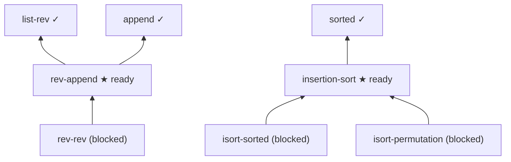

# Agent workflow example

This blueprint is tuned for the **task-orchestration** workflow. The
`tasks` command walks the dependency graph and reports which proof
obligations an agent (or a human) can pick up *right now* versus which are
still blocked on upstream work.

A node is **ready** when:

1. its own formal status is not yet `found`/`proved`, and
2. every node it `uses` is already `found` or `proved`.

## The dependency graph



The three `✓` definitions are already formalised. That unblocks exactly
two tasks (`★`); everything downstream stays blocked until those land.

## Try it

```bash
isabelle-blueprint report examples/agent-workflow
isabelle-blueprint tasks  examples/agent-workflow
isabelle-blueprint compat examples/agent-workflow
```

`tasks` surfaces only the actionable nodes:

```text
# Agent tasks

- **Reverse of an append** (`rev-append`) -> `Sorting.rev_append`
- **Insertion sort** (`insertion-sort`) -> `Sorting.isort_def`

Total: 2 ready task(s).
```

It also writes one prompt file per ready task under
`build/prompts/`, ready to hand to an AI proof assistant.

## Compatibility configuration

`isabelle-blueprint.toml` pins the toolchain and declares an AFP
dependency:

```toml
[isabelle]
version = "Isabelle2024"

[afp]
entry = "List-Index"
required = true
```

`isabelle-blueprint compat` checks the live environment against those
pins. On a machine running a different Isabelle (and without an AFP root
configured) it reports the drift:

```text
error: isabelle-version-mismatch: Expected Isabelle Isabelle2024, found Isabelle2025-2
error: afp-root-missing: [afp].root is required but not configured
```
