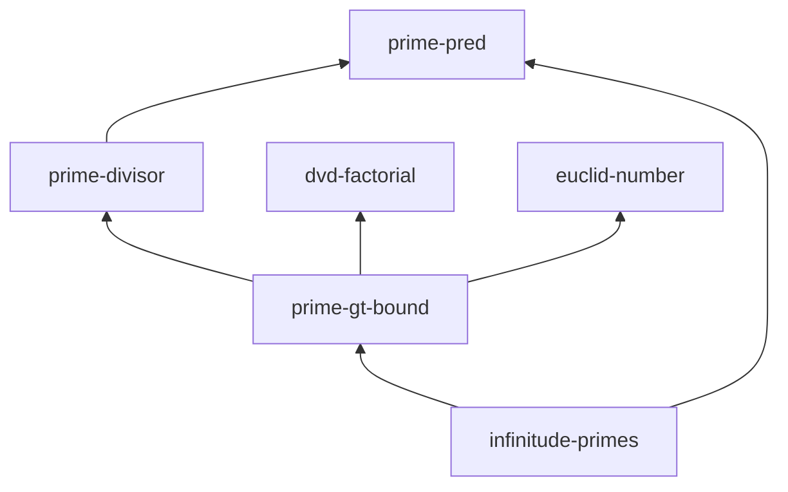

# Infinitude of the primes example

An **intermediate** IsabelleBlueprint project: Euclid's proof that there are
infinitely many primes. Six nodes form a small DAG with two open obligations
near the top, so it demonstrates `report`, the partially-formalised graph, and
the `tasks` list.

## Files

| File | Purpose |
| --- | --- |
| `blueprint.md` | The blueprint: 6 nodes (definitions, helper lemmas, top theorem) with `uses` dependencies. |
| `isabelle-blueprint.toml` | Project config pointing at the `Euclid_Demo` session. |
| `ROOT` | Isabelle session definition. |
| `Euclid_Demo.thy` | A theory with real proofs for the helper lemmas and a drafted (`sorry`) obligation. |

## Try it

```bash
isabelle-blueprint report examples/euclid-primes
isabelle-blueprint graph  examples/euclid-primes
isabelle-blueprint tasks  examples/euclid-primes
```

## What you'll see

`report` summarises 6 nodes at about 67% formalised:

```text
# Infinitude of the primes - blueprint status

- Nodes: **6**
- Formalised (found or proved): **4** (66.7%)

| Formal status | Count |
| --- | ---: |
| `found` | 2 |
| `missing` | 1 |
| `named` | 1 |
| `proved` | 2 |
```

The dependency graph fans the helper lemmas into the bounded-prime obligation
and the open theorem at the top:


