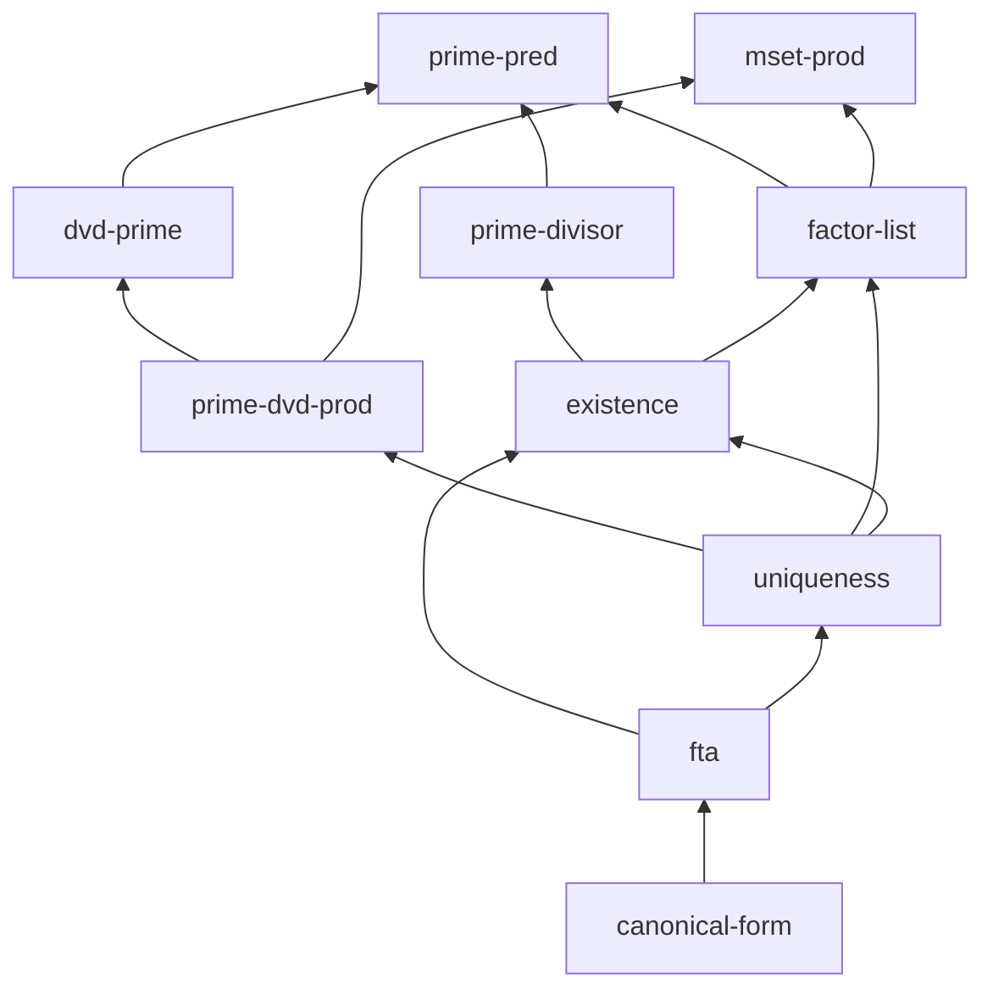

# Fundamental theorem of arithmetic example

The **advanced** project in the gallery: existence *and* uniqueness of prime
factorization. Ten nodes form a multi-level DAG with proved helper lemmas, a
named obligation, and several open theorems — a great stress test for `report`,
the colourful dependency `graph`, and the agent `tasks` list.

## Files

| File | Purpose |
| --- | --- |
| `blueprint.md` | The blueprint: 10 nodes across definitions, helper lemmas, and the capstone theorems. |
| `isabelle-blueprint.toml` | Project config pointing at the `FTA_Demo` session. |
| `ROOT` | Isabelle session definition. |
| `FTA_Demo.thy` | A theory with real proofs for the helper lemmas, a stated existence theorem, and `sorry` placeholders for the open obligations. |

## Try it

```bash
isabelle-blueprint report examples/fundamental-arithmetic
isabelle-blueprint graph  examples/fundamental-arithmetic
isabelle-blueprint tasks  examples/fundamental-arithmetic
```

## What you'll see

`report` summarises 10 nodes at exactly 50% formalised:

```text
# fundamental-arithmetic - blueprint status

- Nodes: **10**
- Formalised (found or proved): **5** (50.0%)

| Formal status | Count |
| --- | ---: |
| `found` | 3 |
| `missing` | 4 |
| `named` | 1 |
| `proved` | 2 |
```

`tasks` highlights the two obligations whose dependencies are all formalised —
the nodes an agent (or a human) can start on **right now**:

```text
# Agent tasks
- **A prime dividing a product of primes** (`prime-dvd-prod`) -> `FTA_Demo.prime_dvd_prod_mset`
- **Existence of a prime factorization** (`existence`) -> `FTA_Demo.factorization_exists`
Total: 2 ready task(s).
```

The dependency graph builds in layers from the definitions at the bottom up to
the fundamental theorem and its canonical-form corollary:


