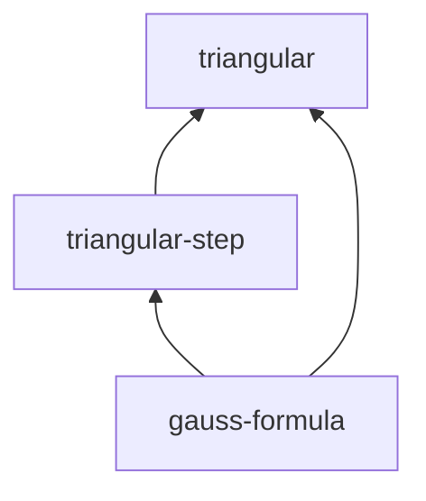

# Gauss summation example

The smallest **end-to-end, fully-proved** IsabelleBlueprint project: the closed
form for the sum of the first `n` natural numbers,
`1 + 2 + ... + n = n * (n + 1) / 2`.

It is written in the **lighter Markdown grammar** (`::: kind {#id}` fences) and
every node carries `formal: proved`, so the graph is **all green** and coverage
is **100%**. Use it as the template for what a *finished* formalization looks
like.

## Files

| File | Purpose |
| --- | --- |
| `blueprint.md` | The blueprint: 3 nodes (definition, lemma, theorem) in the lighter grammar with nested `status:` metadata. |
| `isabelle-blueprint.toml` | Project config pointing at the `Gauss_Demo` session. |
| `ROOT` | Isabelle session definition. |
| `Gauss_Demo.thy` | A real theory (no `sorry`) with the referenced fact names. |

## Try it

```bash
# Status report (no Isabelle required)
isabelle-blueprint report examples/gauss-sum

# Dependency graph (DOT + JSON; SVG if graphviz `dot` is installed)
isabelle-blueprint graph examples/gauss-sum

# Generate the static HTML site
isabelle-blueprint web examples/gauss-sum
```

## What you'll see

`report` shows all three nodes formalised — 100% coverage:

```text
# Gauss summation formula - blueprint status

- Nodes: **3**
- Formalised (found or proved): **3** (100.0%)

| Formal status | Count |
| --- | ---: |
| `proved` | 3 |
```

The dependency graph is a short chain from the definition up to the theorem:


