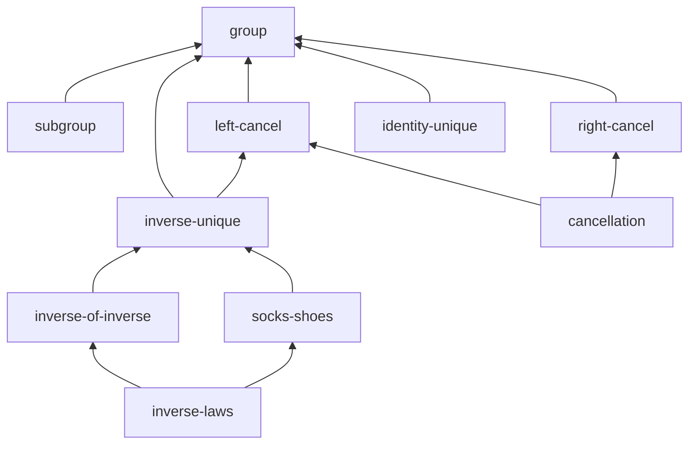

# Group theory example

A larger IsabelleBlueprint project than [`minimal`](../minimal): the
elementary theory of groups. It exercises a **multi-level dependency graph**
and a **mix of formal statuses** (`missing` / `named` / `found` / `proved`),
so it's a good reference for the graph view, the generated site, and agent
task lists.

## Files

| File | Purpose |
| --- | --- |
| `blueprint.md` | The blueprint: 10 nodes (definitions, lemmas, theorems) with `uses` dependencies and status metadata. |
| `isabelle-blueprint.toml` | Project config pointing at the `Group_Demo` session. |
| `ROOT` | Isabelle session definition. |
| `Group_Demo.thy` | A theory stub with the referenced fact names. |

## Try it

```bash
# Status report (no Isabelle required)
isabelle-blueprint report examples/group-theory

# Dependency graph (DOT + JSON; SVG if graphviz `dot` is installed)
isabelle-blueprint graph examples/group-theory

# Agent-ready tasks (proof obligations whose dependencies are formalised)
isabelle-blueprint tasks examples/group-theory
```

## What you'll see

`report` summarises 10 nodes with a headline coverage of 28% (2 of 7
formal targets proved), plus a breakdown across `found`, `proved`,
`named`, and `missing`:

```text
# Group theory demo - blueprint status

- Nodes: **10**
- Formal targets (with Isabelle ref): **7**
- Proved: **2**
- Found (exists, not yet trusted): **3**
- Problems (broken/not_found/tainted/failed_check): **0**
- Coverage (proved / formal targets): **28%** (2/7)

| Formal status | Count |
| --- | ---: |
| `found` | 3 |
| `missing` | 3 |
| `named` | 2 |
| `proved` | 2 |
```

`tasks` lists the four obligations whose dependencies are already
formalised — these are the ones an agent (or a human) can pick up next:

```text
# Agent tasks

- **Subgroup** (`subgroup`) -> `Group_Demo.subgroup_def`
- **Inverse of the inverse** (`inverse-of-inverse`) -> `Group_Demo.inverse_of_inverse`
- **Socks-and-shoes law** (`socks-shoes`) -> `Group_Demo.socks_shoes`
- **Cancellation theorem** (`cancellation`) -> `Group_Demo.cancellation`

Total: 4 ready task(s).
```

The dependency graph fans out from `group` up to the two top-level
theorems:


