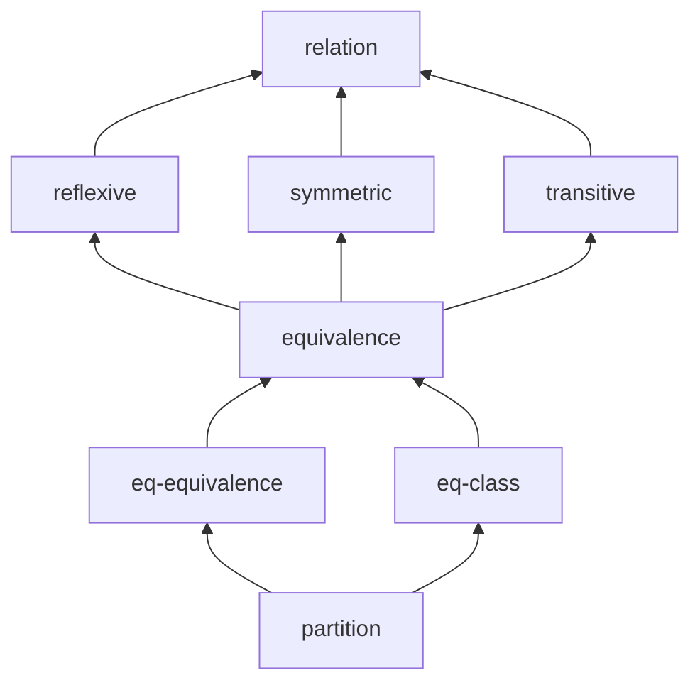

# LaTeX blueprint example

IsabelleBlueprint can ingest blueprints written in **LaTeX** as well as
Markdown. This example develops the basic theory of relations and
equivalence classes in `blueprint.tex`.

This is the same workflow popularised by Patrick Massot's `leanblueprint`:
you annotate ordinary theorem-like environments with a few macros and the
tool builds the dependency graph and status report from them.

## How nodes are written

Each `definition` / `lemma` / `theorem` environment becomes a node:

```latex
\begin{lemma}[Equality is an equivalence]
\label{eq-equivalence}          % node id (required)
\isabelle{Relations.eq_equivalence}  % the Isabelle fact it maps to
\isabelleok                     % upgrades "named" -> "found"
\uses{equivalence}              % dependencies (comma/space separated)
\tags{examples}
The equality relation is an equivalence relation on $A$.
\begin{proof}                   % becomes the informal proof
Reflexivity, symmetry, and transitivity of $=$ are immediate.
\end{proof}
\end{lemma}
```

| Macro | Meaning |
| --- | --- |
| `\label{id}` | Node id (**required**). |
| `\isabelle{fact}` | The Isabelle fact this node formalises. |
| `\isabelleok` | Marks the fact as checked → formal status `found`. |
| `\uses{a, b}` | Dependencies on other node ids. |
| `\tags{...}` | Free-form tags. |
| `\begin{proof}…\end{proof}` | Informal proof text. |

## Try it

```bash
isabelle-blueprint report examples/latex-blueprint
isabelle-blueprint graph  examples/latex-blueprint
```

`report` shows 8 nodes at 50% formalised — the three definitions carrying
`\isabelleok` plus the equality lemma come back as `found`, while the
nodes with a fact but no `\isabelleok` stay `named`:

```text
# Relations blueprint (LaTeX) - blueprint status

- Nodes: **8**
- Formalised (found or proved): **4** (50.0%)

| Formal status | Count |
| --- | ---: |
| `found` | 4 |
| `named` | 4 |
```


