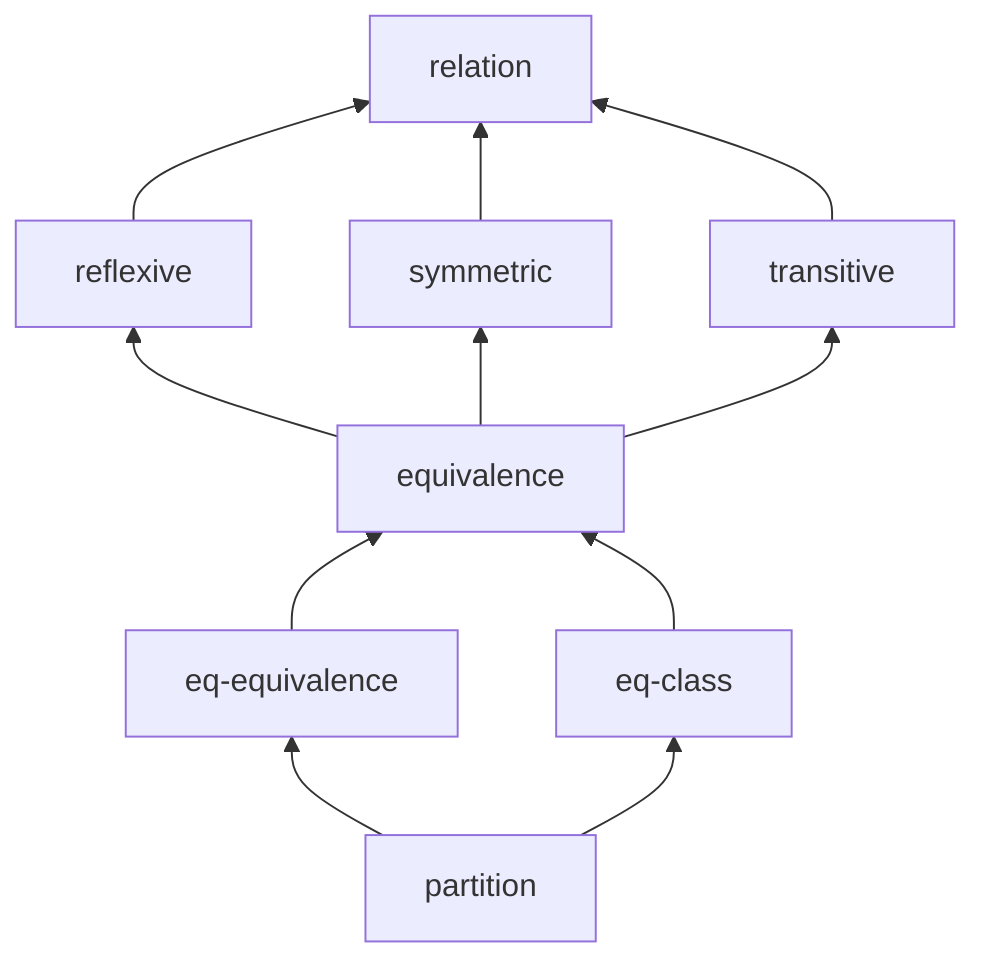

# LaTeX blueprint example

IsabelleBlueprint can ingest blueprints written in **LaTeX** as well as
Markdown. This example develops the basic theory of relations and
equivalence classes in `blueprint.tex`.

This is the same workflow popularised by Patrick Massot's `leanblueprint`:
you annotate ordinary theorem-like environments with a few macros and the
tool builds the dependency graph and status report from them.

## How nodes are written

Each `definition` / `lemma` / `theorem` environment becomes a node:

```latex
\begin{lemma}[Equality is an equivalence]
\label{eq-equivalence}          % node id (required)
\isabelle{Relations.eq_equivalence}  % the Isabelle fact it maps to
\isabelleok                     % upgrades "named" -> "found"
\uses{equivalence}              % dependencies (comma/space separated)
\blueprintstatus{written}
\formalstatus{found}
\agentstatus{ready}
\tags{examples}
The equality relation is an equivalence relation on $A$.
\begin{proof}                   % becomes the informal proof
Reflexivity, symmetry, and transitivity of $=$ are immediate.
\end{proof}
\end{lemma}
```

| Macro | Meaning |
| --- | --- |
| `\label{id}` | Node id (**required**). |
| `\isabelle{fact}` | The Isabelle fact this node formalises. |
| `\isabelletheory{Theory}` / `\isabellesession{Session}` | Optional explicit Isabelle context when the fact name is not fully qualified. |
| `\isabelleok` | Marks the fact as checked → formal status `found`. |
| `\uses{a, b}` | Dependencies on other node ids. |
| `\tags{...}` | Free-form tags. |
| `\status{...}` | Single-axis shorthand such as `stub`, `found`, or `ready`. |
| `\blueprintstatus{...}` / `\formalstatus{...}` / `\agentstatus{...}` | Explicit three-axis status metadata, matching Markdown `status:` blocks. |
| `\begin{proof}…\end{proof}` | Informal proof text. |

## Try it

```bash
isabelle-blueprint report examples/latex-blueprint
isabelle-blueprint graph  examples/latex-blueprint
```

To start a new LaTeX-first project, pass `--format latex` to any starter
template:

```bash
isabelle-blueprint init my-project --template agent-ready --format latex
isabelle-blueprint new theorem main-result my-project --append
```

`report` shows 8 nodes at 0% coverage (proved / formal targets: 0/8) — the
headline metric now counts proved facts against formal targets, and nothing
is proved yet. The three definitions carrying `\isabelleok` plus the equality
lemma still come back as `found`, while the nodes with a fact but no
`\isabelleok` stay `named`:

```text
# Relations blueprint (LaTeX) - blueprint status

- Nodes: **8**
- Formal targets (with Isabelle ref): **8**
- Proved: **0**
- Found (exists, not yet trusted): **4**
- Problems (broken/not_found/tainted/failed_check): **0**
- Coverage (proved / formal targets): **0%** (0/8)

| Formal status | Count |
| --- | ---: |
| `found` | 4 |
| `named` | 4 |
```


