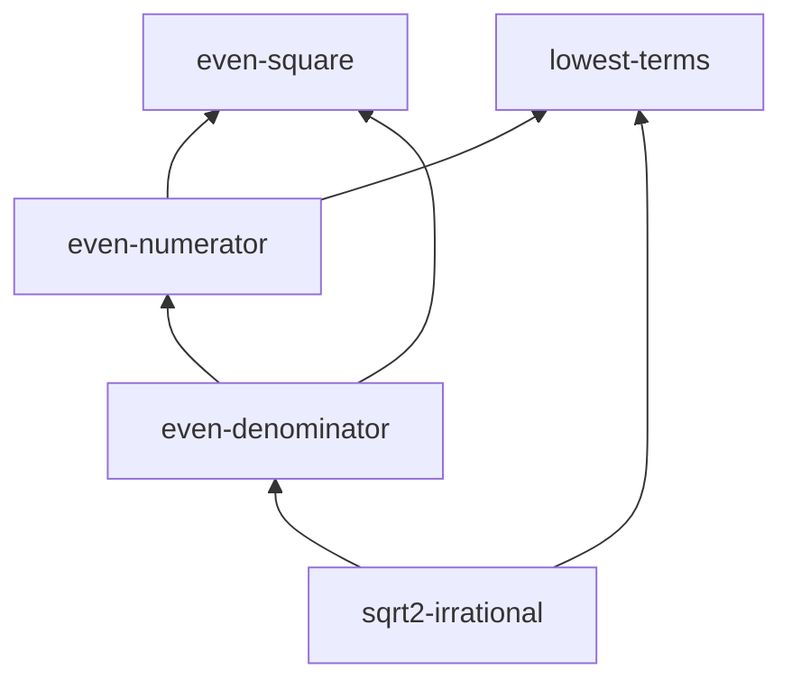

# sqrt 2 is irrational example

An **intermediate, in-progress** IsabelleBlueprint project: the classic proof that
`sqrt 2` is irrational. It mixes formal statuses on purpose
(`proved` / `found` / `named` / `missing`), so it is the best reference for the
**status colours**, the partially-green graph, and the **agent task list**.

## Files

| File | Purpose |
| --- | --- |
| `blueprint.md` | The blueprint: 5 nodes (lemmas + the top theorem) with `uses` dependencies and a mix of statuses. |
| `isabelle-blueprint.toml` | Project config pointing at the `Sqrt2_Demo` session. |
| `ROOT` | Isabelle session definition. |
| `Sqrt2_Demo.thy` | A theory with real proofs for the `proved` nodes and a drafted (`sorry`) lemma. |

## Try it

```bash
# Status report (no Isabelle required)
isabelle-blueprint report examples/sqrt2-irrational

# Dependency graph (DOT + JSON; SVG if graphviz `dot` is installed)
isabelle-blueprint graph examples/sqrt2-irrational

# Agent-ready tasks (obligations whose dependencies are formalised)
isabelle-blueprint tasks examples/sqrt2-irrational
```

## What you'll see

`report` summarises 5 nodes with 50% coverage (2 of 4 formal targets proved),
across `proved`, `found`, `named`, and `missing`:

```text
# Irrationality of sqrt 2 - blueprint status

- Nodes: **5**
- Formal targets (with Isabelle ref): **4**
- Proved: **2**
- Found (exists, not yet trusted): **1**
- Problems (broken/not_found/tainted/failed_check): **0**
- Coverage (proved / formal targets): **50%** (2/4)

| Formal status | Count |
| --- | ---: |
| `found` | 1 |
| `missing` | 1 |
| `named` | 1 |
| `proved` | 2 |
```

The dependency graph shows the two green building blocks feeding the
not-yet-finished denominator lemma and the open top-level theorem:


